# Introduction

Coral reef ecosystems face rapid global decline driven by climate
change, with mass bleaching events increasing in both frequency and
severity [@bozecRapidlyClosingWindow2025; @hughesGlobalWarmingTransforms2018]. Conservation
decisions must be made today despite profound uncertainty about future
conditions and system response, with consequences unfolding over
decades. This condition of deep uncertainty, wherein probability
distributions over key drivers cannot be reliably specified [@lempertUseDecisionMaking2024], motivates decision support tools that are capable of
exploring a wide range of plausible futures rather than optimizing
against a single projected outcome. Computational tractability of models
underpinning decision support is therefore a core design requirement:
the model must be able to evaluate thousands of scenarios at low cost to
inform development of effective policies [cf. @arnoldAdhocModellingStrategic2020].

A persistent challenge is determining appropriate model structure.
Models must capture the dynamics relevant to a given purpose while
remaining simple enough to justify parameterization with available data
and to evaluate across the large scenario ensembles that deep
uncertainty demands [@lempertUseDecisionMaking2024; @stantonDecisionMakingDeep2021].
Marine ecosystems compound this challenge as direct observation is
costly, continuous monitoring is typically infeasible, and data sparsity
means expert knowledge heavily shapes model design, risking the
introduction of factors whose influence is negligible [@bodeRevealingBeliefsUsing2017]. A systematic workflow is presented wherein empirical sensitivity
analysis, conducted prior to model development, guides structural
decisions. Rather than incorporating all processes assumed to be
important, model complexity is constrained by what available data can
distinguish from random variation at the spatial scales of interest.
Factors falling below this threshold are excluded on objective grounds,
reducing the curse of dimensionality without sacrificing ecological
realism.

The workflow is demonstrated using demographic data from the EcoRRAP
monitoring program (Ecological Intelligence for Reef Restoration and
Adaptation Program; @australianinstituteofmarinescienceEcologicalIntelligenceReef2025), which
has generated colony-level observations via orthorectified photomosaics
across the Great Barrier Reef (GBR). A moment-independent global sensitivity
analysis method (Pianosi and Wagener, 2018, 2015) is applied to these data to
discern key factors that drive annualized growth and survival across five dominant
functional groups of hard coral, including tabular *Acropora*, corymbose *Acropora*,
branching non-*Acropora*, Small massives (and encrusting), and Large massives.
These findings directly shape the structure of Kora, a size-structured
population model operating on discrete annual timesteps. Growth and
mortality functions are parameterized separate per functional group via
polynomial regression on field observations. Sub-second simulation
performance enables extensive ensemble scenario exploration required for
model-informed decision support.

The current implementation of Kora operates on a single representative
reef area. The model's ability to reproduce plausible historic coral
cover trajectories is demonstrated and assessed herein. Ecological
realism is established through ensemble calibration with estimates of
coral cover around the reef perimeter (manta-tow observations) collected
by the AIMS LTMP (Long-Term Monitoring Program). Parametric uncertainty
and identifiability were then explicitly quantified. Applications to
intervention strategy evaluation are addressed in future work.

# Model development workflow

The overarching aim of the model is to provide indicative projections of coral dynamics under
ambient and disturbed conditions (principally marine heatwaves). Parsimony is achieved by
identifying factors that represent the dynamics of dominant coral functional groups and their
respective contributions to overall coral cover, as evidenced by available data. To this end,
empirical sensitivity analysis was conducted on data from the Ecological Intelligence for Reef
Restoration and Adaptation Program (EcoRRAP; @australianinstituteofmarinescienceEcologicalIntelligenceReef2025)
to identify principal drivers of growth and survival dynamics. The assessment informed model
structure and constraining equifinality and issues of parameter identifiability.

Equifinality refers to the case where multiple parameter combinations
produce similar, equally plausible outcomes. Identifiability is the
ability to attribute cause and effect to any single parameter or a
unique parameter set [@guillaumeIntroductoryOverviewIdentifiability2019; @luoParameterIdentifiabilityConstraint2009].
In high-dimensional cases (e.g., models with many parameters), factors can
interact, with parameter combinations effectively compensating for one
another, making it difficult to determine which factors genuinely
influence modelled outcomes. Factor interaction and compensation degrade both
model interpretability and predictive reliability, hence the common
advice to retain as much simplicity as possible with respect to the
model purpose [@jakemanTenIterativeSteps2006; @majonePitfallsAnalysis1980].
Representing all possible influences on coral growth and mortality would
substantially increase model dimensionality, leading to identifiability
issues and inflated computational cost inconsistent with the goal of
supporting timely model-informed decision making.

Model performance is assessed against available observations of coral cover
and functional composition. Two reefs are used for this purpose:
Moore Reef (in the GBR Offshore North), which has a long monitoring history enabling calibration against
historical cover dynamics, and Masig Reef (Torres Strait), representing
a data-limited setting with differing community compositions. The
location of the reefs in question is indicated in [Figure
1](#_Ref227414714).

![[]{#_Ref227414714 .anchor}Figure 1. Panel A: Map of the Great Barrier
Reef with the study reefs marked; other reef outlines in gray. Panel B:
Close up of the Torres Strait study reefs (Masig Reef marked with an
orange star). Panel C: Close up of the Offshore North region and study
reefs (Moore Reef marked with a blue
star).](../figs/study_area_overview.png){width="6.067281277340332in" height="5.2in"}

The EcoRRAP monitoring program has collected colony-level demographic
observations across the study area (GBR and Torres Straits) via
orthorectified photomosaics since 2021 [@gordonFieldPhotogrammetry4D2023; @toorFieldPhotogrammetry4D2025].
Each photomosaic campaign produces spatially and temporally
registered imagery from which individual coral colonies are digitized
(precision 1.6mm; @lecheneEvaluatingErrorSources2024), colony diameters estimated and
survival status at successive timepoints. These data were combined with
*in situ* data for juvenile coral demographics [@doropoulosImpactEnvironmentalGradients2025], collected from within the same plots. For the sensitivity
analysis, data from Moore and Lizard Reefs were used to assess the GBR
Offshore North region, spanning up to 34 taxa (31 for growth, 34 for survival) across four habitat
types (reef back, flank, front, and lagoon) over February 2021 to December 2023, spanning two annual transitions.

For the GBR Offshore North (Moore and Lizard Reefs), the dataset
comprised 5,858 growth observations and 10,988 survival observations
across 43 plots grouped into 7 monitoring sites, with a mean survey
interval of 320 days (SD: 88 days; range: 118–772 days). For the Torres Strait, data from Aukane,
Dungeness, and Masig Reefs were collected over April 2021 to March 2023, spanning
up to 31 taxa (29 for growth, 31 for survival)
across four habitat types (reef back, flank, front, and lagoon),
comprising 2,863 growth observations across 78 quadrats and 5,839
survival observations across 84 quadrats, grouped into 10 monitoring
sites, with a mean survey
interval of 336 days (SD: 6 days; range: 323–357 days). Interested readers are
directed to the relevant Standard Operating Procedures for further
details on the data collection (Gordon et al. 2023), processing of
images into photomosaics [@gordonFieldPhotogrammetry4D2025] or the digitization of
coral colonies to produce these data [@toorFieldPhotogrammetry4D2025]. Growth and
survival regressions for Kora were parameterized from data for specific
reefs.

An overview of the 12 factors assessed is provided in [Table
1](#_Ref226801182). Raw transitions between successive observations were
standardized to annual rates via Euler approximation (see Section
[3.2.1](#growth-models)), accounting for the variable interval between
surveys. Of the 12 factors, three relate to the spatial location of
monitoring activities (quadrat/plot identity, long, lat; see [Table
1](#_Ref226801182)) but were retained for completeness, as they
represent different spatial scales.

Demographic observations were combined with observed depth measurements at each
monitored site, as well as modelled depth estimates derived from bathymetry data
[Callaghan, 2023; @callaghanWaveModellingProxy2015]. Modelled estimates of temperature, and modelled wave and
tidal forcings were also included for the Offshore North region. Such modelling is not currently
available for the Torres Strait region. Daily sea water temperature
estimates were obtained from the eReefs GBR1 Hydro v2 hydrodynamic model
[~1km resolution, daily time step; @bairdCSIROEnvironmentalModelling2020; @stevenEReefsOperationalInformation2019] via the
*eReefs* portal (extraction ID: 2607.0ece0eb, https://portal.ereefs.org.au/). These variables were included as
candidate predictors given established evidence that temperature and
localized wave energy influence coral growth and recovery patterns
[@jurriaansWaveEnergyOther2025; @warneMathematicalModellingUncertainty2025; @whitmanSeededAcroporaDigitifera2025], and
on the basis of recommendations from the literature [@alvarez-noriegaSpatialVariationUpper2024] [\[Ashton et al., under]{.mark} [review\]]{.mark}.

*In situ* logger temperature collected by the EcoRRAP program [@australianinstituteofmarinescienceaimsEcoRRAPOceanographicLogger2023] was considered but excluded from the analysis. Available data is obtained by a single logger at select locations, producing one time-series that was averaged to a scalar per inter-survey period. At Moore Reef - the only Offshore North reef with a logger deployment - this yields four unique temperature values (one per survey transition and depth stratum combination) making logger temperature fully collinear with survey period and depth stratum. As PAWN is a distribution-based method, a near-constant predictor with no within-stratum variation cannot discriminate demographic outcomes, and its inclusion would give a misleading impression that *in situ* thermal data constituted a meaningful candidate factor. eReefs modelled temperature was retained, as it provides spatially-varying daily estimates from the hydrodynamic model at approximately 1 km resolution across multiple depth levels (ranging from 2.35 m to 18 m), offering greater spatial and temporal coverage than sparse *in situ* observations.

#### Environmental data depth assignment

Environmental variables from eReefs are available across discrete depth levels. For temperature assignment, observations at 9 m below the surface were designated as the target depth. When data at this exact depth was unavailable for a given site-date combination, a hierarchical depth-matching procedure was applied: (1) use exact target depth (−9.0 m) if available, (2) if not available, use the nearest shallower depth, and (3) as a final fallback, use records with unknown depth. This approach balances fidelity to the intended sampling depth with maximizing spatial-temporal coverage of environmental covariates. The procedure was applied transparently with diagnostic reporting quantifying coverage gaps and recording which fallback depths were substituted, allowing assessment of potential bias introduced by depth-based assignment.

: []{#_Ref226801182 .anchor}Table 1. Overview of factors assessed in
the sensitivity analysis for the GBR Offshore North and Torres Strait
regions. Count and range are computed over unique site-level values
where applicable, or over all observations for continuous covariates.
N/A indicates a factor was not available for that region.
\*\* Factor is site-invariant within the region (single unique value)
and therefore contributes near-zero PAWN sensitivity.
The Offshore North `quadrat_number` count (41 unique quadrat labels)
differs from the 43 plots reported above, which additionally distinguish
plots by depth stratum.



## The PAWN method

PAWN (named after the creators, [@pianosiDistributionbasedSensitivityAnalysis2018, @pianosiSimpleEfficientMethod2015])
is a moment-independent method originally developed to assess sensitivity of model outputs to input
factors. It quantifies the individual factor influence on output
distributions by comparing the Cumulative Distribution Function (CDF) of
observations conditioned on specific factor values against the
unconditional CDF. The method captures non-linear relationships,
threshold effects and interactions through its distribution-based
comparisons. Conceptual simplicity is a further advantage, aiding
communication of results to stakeholders unfamiliar with sensitivity
analysis. The objective of the sensitivity analysis is to identify which
factors drive observed demographic patterns (or are sufficient proxies
for such dynamics), providing an empirical basis for structural
decisions during model development (Section [3.2](#model-development)).

Diameter and survival at $t + 1$ were modeled as dependent variables,
with diameter at $t$ and other environmental and ecological factors as
predictors (overview in [Table 1](#_Ref226801182)). Analyses were
conducted for each functional group (detailed in Section
[3.1](#functional-groups)). To establish a baseline for factor
significance, a random noise variable [a "dummy" factor; cf.
@khorashadizadehComparisonVariancebasedMomentindependent2017] was included in all analyses, providing an objective
threshold. Factors whose influence was indistinguishable from random
variation were considered non-influential and excluded.

Summary statistics across slices produce a single sensitivity index for
each factor. Here, a "slice" is a conditioning interval for a given
factor ($x_{i}$), formed by partitioning the observed range of $x_{i}$
into $N_{s}$ quantile-based intervals, where $N_{s}$ denotes the number
of slices. Within each slice ($I_{k}$, $k \in \lbrack 1,N_{s}\rbrack$),
the subset of output observations corresponding to $x_{i} \in I_{k}$ is
used to construct the conditional CDF
($\Phi_{Y}|x_{i}\left( y \middle| x_{i} \in I_{k} \right)$). A larger
$N_{s}$ produces finer conditioning intervals and a more detailed
characterization of the output distribution but requires proportionally
larger samples to avoid sparse slices. The PAWN method is detailed here
as:

$${PAWN_{x_{i}} = stat\left\{ KS\left\lbrack \Phi_{Y} \middle| x_{i}\left( y \middle| x_{i} \in N_{s} \right),\ \Phi_{Y} \right\rbrack \right\}
}$$

$${PAWN_{i} = PAWN_{x_{i}} - PAWN_{dummy}}$$ {#eq-pawn}

Where:

- $x_{i}$ is the factor of interest (depth, diameter at time $t$, etc.)

- $\Phi_{Y}|x_{i}\left( y \middle| x_{i} \in N_{s} \right)$ is the
  conditional CDF of output $y$ (growth or survival) when $x_{i}$ is
  constrained to slice $N_{s}$

- $\Phi_{Y}$ is the unconditioned CDF of output $y$ (diameter or
  survival at $t + 1$)

- $stat$ indicates the summary statistic of interest, such as the mean,
  median, min/max

- $KS$ denotes the Kolmogorov-Smirnov test statistic, of which a summary
  statistic ($stat$) is taken across slices

- $PAWN_{x_{i}}$ is the PAWN sensitivity index for factor $x_{i}$

- $PAWN_{dummy}$ is the index for the random noise variable

- $PAWN_{i}$ is the reported index for a given summary statistic (mean,
  median, etc.)

Larger values of $PAWN_{i}$ indicate greater influence. Negative values
indicate factors are less influential than random noise, providing an
objective basis for exclusion and reducing model dimensionality without
relying solely on expert assumption. While the median of slices is
typically the reported measure, the mean is adopted here as the primary
sensitivity statistic, as it better captures the influence of a factor
across its full range, including regions where its effect is strongest.
Here, the Kolmogorov-Smirnov test statistic is adopted to quantify the
maximum difference between CDFs, although alternate statistical tests
can be applied. This process is repeated for all factors of interest
using 10 slices (i.e., $N_{s} ≔ 10$) per factor following Pianosi and
Wagener (2018).

## Results of sensitivity analysis

Colony diameter was found to be the most influential with respect to
estimated growth rates in both the Offshore North and Torres Strait
regions ([Figure 2](#_Ref219542531)). Additional PAWN analysis across
binned diameter classes indicates the influence is typically strongest
at the smallest and largest diameters ([SFigure 1](#_Ref226823031)).
Taxonomic identity was also a source of variation in estimated growth,
though less so than colony diameter.

Colony diameter screened in as an influential factor for survival across both regions ([Figure 3](#_Ref219542540)A, B). In the Offshore North, depth and the temporally aggregated eReefs temperature also screened above the dummy threshold; however, reef-level analysis at Moore Reef ([Figure 3](#_Ref219542540)C) shows both eReefs temperature metrics (averaged mean and maximum) at or near the dummy threshold when Moore is examined in isolation. This is consistent with the regional temperature acting as a spatial proxy for between-reef differences (Moore vs. Lizard Reefs have distinct mean thermal environments) rather than reflecting a direct thermal effect on colony survival. This interpretation is further supported by the study window spanning non-disturbance years (2021--2023), during which ambient temperature variation would not be expected to discriminate colony-level outcomes. Binned analysis reveals the influence of locational differences on survival remain consistent across diameter classes in the Offshore North ([SFigure 2](#_Ref226823311)), whereas taxa and functional group identity were more prominent secondary contributors in the Torres Strait. These findings are perhaps to be expected given the Offshore North is represented by sites across Moore and Lizard Reefs (two large reefs) with greater variation in environmental conditions compared to the Torres Strait region (represented by three much smaller reefs).

Comparing results at the reef level, diameter and taxon were closely competitive in influencing survival on Moore Reef ([Figure 3](#_Ref219542540)C), with no single factor as clearly dominant as diameter is for growth. Functional group and depth emerged as secondary contributors. In comparison, diameter plays a greater role towards survival on Masig Reef ([Figure 3](#_Ref219542540)D), with functional group and taxon as secondary factors. Wave and tidal forcings
("bottom_stress") exerted negligible influence on survival and growth
across all examined regions and reefs, as did temperature at every scale
except regional Offshore North survival, where — as noted above — it acts
as a proxy for between-reef differences rather than a direct thermal
signal. The sensitivity index
characterizes what a given dataset can resolve at the scales examined
and does not indicate what is ecologically meaningful. The low influence
of wave and tidal forcing and temperature is therefore a statement about
material importance for modelling rather than its ecological relevance.
Both were available only as spatially and temporally aggregated modelled
outputs ([Table 1](#_Ref226801182)), at a resolution that may obscure
effects operating at finer scales. The same principle governs the
factors that are ranked highly. Colony diameter and functional group are
identified as dominant because their influence is resolvable in these
data, not strictly because the excluded factors are absent from the
system.

Interestingly, growth and survival are shown to be largely insensitive to
habitat type at reef level for both regions ([Figure 2](#_Ref219542531)C, D
and [Figure 3](#_Ref219542540)C, D): habitat falls below the dummy
threshold at Masig Reef and, while marginally above it at Moore Reef,
remains far below colony diameter and taxonomic identity. The same holds
across diameter classes at the regional scale ([SFigure
1](#_Ref226823031)). One potential interpretation is that
corals observed in monitoring surveys represent a habitat-filtered
subset of the original settling population: individuals that failed to
establish in each habitat having been removed prior to observation. In
this conceptualization, habitat effects on coral performance may be
expressed primarily through differential early post-settlement survival
rather than through differential growth among survivors and would not be
detectable in growth data derived from established colonies. This
interpretation is broadly consistent with findings from other studies on
the GBR, where no single environmental factor has been identified as a
strong predictor of seeded coral performance [@jurriaansWaveEnergyOther2025].

These findings highlight the importance of considering the Modifiable
Areal Unit Problem [MAUP; @holtAggregationEcologicalEffects1996; Kwan, 2012; @rileyRealWorldData2024]. Conclusions drawn on one spatial scale do not necessarily
transfer to another, and a model generalized for a region may therefore
provide indicative projections without being applicable to any specific
area within it. The scale-dependence of spatial aggregation and the
resolvability of individual factors are two aspects of one principle: a
sensitivity analysis describes the evidence available at a given scale
and resolution, not the underlying ecology. Colony size and
taxa/functional group nonetheless emerge as the common dominant
structural factors across both reef and sub-reef scales, providing a
consistent empirical basis for model design. The structural decisions
described in Section [3](#model-description) omit factors because
available data cannot resolve their influence.

![[]{#_Ref219542531 .anchor}Figure 2. PAWN sensitivity analysis for
growth across the spatial areas of interest from the GBR Offshore North
(Panel A), Torres Strait (Panel B), and the specific reefs in both
regions (Moore Reef and Masig Reef; Panel C and D respectively). The
mean and standard deviation PAWN indices are shown, sorted by mean
values (highest to lowest; from left to right). Analyses illustrate that
coral diameter is consistently the most influential factor across the
spatial scales of
interest.](../figs/sensitivity/combined/SA_growth.png){width="5.22451990376203in"
height="7.4736307961504815in"}

![[]{#_Ref219542540 .anchor}Figure 3. PAWN sensitivity analysis for
survival across the spatial areas of interest from the GBR Offshore
North (Panel A), Torres Strait (Panel B), and the specific reefs in both
regions (Moore Reef and Masig Reef; Panel C and D respectively). The
mean and standard deviation PAWN indices are shown, sorted by mean value
(highest to lowest; from left to right). Colony diameter screened in as an influential factor for survival across both regions. In the Offshore North, the regional eReefs temperature indices and depth also screened above the dummy threshold as secondary contributors; the temperature indices fell to at or near the threshold at the reef level (Panel C), consistent with a between-reef spatial effect rather than a direct thermal signal. Diameter and taxon were closely competitive on Moore Reef (Panel C), with functional group as a secondary contributor. Diameter and taxa/functional group are consistently relevant for the Torres Strait, represented by smaller reefs.](../figs/sensitivity/combined/SA_survival.png){width="5.239583333333333in"
height="7.495179352580927in"}

# Model description

Kora is a size-structured model implemented with the high-performance
Julia programming language [@bezansonJuliaFreshApproach2017a]. Coral growth and
background mortality are parameterized directly from field photomosaics
and juvenile quadrat data (Australian Institute of Marine Science
(AIMS), 2023; @doropoulosImpactEnvironmentalGradients2025; @gordonFieldPhotogrammetry4D2023; @toorFieldPhotogrammetry4D2025). Representation of acute environmental disturbances focused on
marine heatwaves, a key concern under projected climate conditions
[@hendrickxOnlinecouplingWidelyrangedTimescales2021]. The model simulates coral reef dynamics with
comparatively low structural data requirements: the principal drivers are colony
diameters and Degree Heating Weeks, meaning growth and survival functions need only
describe how rates vary with colony size. In practice, directly measuring
size-structured demographic rates is itself demanding; where field data are
unavailable, hypothetical growth and survival curves based on expert knowledge and
published estimates can be substituted. Kora supports this through a JSON-based
parameter specification, allowing practitioners to encode assumed functional forms
without requiring locally collected colony-level observations.

Kora operates on a discrete annual basis as continuous representation of
intra-annual dynamics was deemed unnecessary for the purpose of
producing indicative future trajectories. A key assumption is that
background mortality occurs throughout each year and so is applied first
to represent the events of the past year. The survivors then go on to
reproduce, and their progeny settle alongside any corals that are
deployed through anthropogenic intervention. In the GBR, coral spawning
occurs over October and November, prior to peak heatwaves which
typically occur over summer (December - April). As such, heat stress is
applied last, the survivors of which then go on to grow (increase in
diameter) and the process repeating until end of simulation.

A representative reef area is modelled, which serves to act as a proxy
for a given locale whether this be a transect, reef plot, site, or even
an entire reef itself. The simulated area represents a contiguous coral
habitable area. Kora is not spatially explicit, and so corals within the
simulated area are assumed to be uniformly distributed and constrained
to the available habitable space. A single model evaluation on a
standard laptop can be conducted in 50 to 100 milliseconds (0.05 -- 0.1
seconds) for a representative 288m^2^ area. This performance makes the
model suitable for participatory workshop settings, where decision-maker
preferences can be elicited and the implications of management options
explored interactively in near real-time. For a single location and
five functional groups, Kora involves 58 factors, although not all are
required to be considered for a given application. An overview of its
computational scalability is offered in [Supplementary A: Software
Implementation Details](#supplementary-a-software-implementation-details).

Each coral colony is tracked by diameter size (cm) and functional group,
with the population capped to a maximum of 20 individuals per m². While
space is not explicitly represented, growth declines as inhabited area
approaches carrying capacity (the maximum area inhabitable by coral),
capturing competitive advantage of larger colonies and faster growing
corals as well as size-dependent mortality without spatially explicit
tracking. The model framework also tracks the population\'s thermal
tolerance (in terms of Degree Heating Weeks, DHW).

The case of a single reef area is described here for the purpose of
detailing model implementation. The population state at time $t$ for a
given functional group and spatial location is represented as the
indexed multiset of colony diameters:

$$X_{t} = \left\{ d_{i,t}\ :i = 1,\ \ldots,\ \left| X_{t} \right| \right\},\ d_{i,t} \in \mathbb{R}_{> 0}$$ {#eq-population-state}

where $d_{i,t}$ is the diameter (in cm) of colony $i$. The temporal
dynamics of this population are then described by:

$$Z_{t} = S_{E}\left( S_{B}\left( X_{t} \right),\ \theta_{t} \right),\ Z_{t} \subseteq X_{t}$$

$$X_{t + 1} = G_{t}\left( Z_{t} \cup R\left( Z_{t} \right) \right) \cup H_{t}$$ {#eq-temporal-dynamics}

$S_{B}$ is a size-dependent background mortality operator that
stochastically removes colonies from $X_{t}$, yielding a subset of
survivors. Environmental mortality $S_{E}( \cdot ,\theta_{t})$ then acts
on that subset, where $\theta_{t}$ denotes experienced degree heating
weeks (DHW). Both mortality operators only remove colonies from $X_{t}$.
Colonies that reach and exceed the minimum reproductive size threshold
(assumed to be \> 5cm) in $Z_{t}$ contribute to natural recruitment:

$$R\left( Z_{t} \right) = \left\{ d_{j,t}\ :j = 1,\ \ldots,\ n_{r} \right\},\ d_{j,t}\sim N(1.5,0.2)\ truncated\ to\ \lbrack 0.5,\ 2.5\rbrack cm$$ {#eq-recruitment-natural}

where $n_{r}$ is the number of new settlers determined by the
reproductive output of mature colonies in $Z_{t}$. Recruit diameters are
drawn from a truncated normal distribution representing the approximate
size range of one-year-old corals.
$H_{t} = \{ d_{k,t}:k = 1,\ldots,n_{h}\}$ is the set of colonies added
through anthropogenic intervention, assumed to settle concurrently with
natural recruits. The size-dependent growth operator $G_{t}$ then
advances every colony diameter forward by one timestep:

$$G_{t}(A) = \left\{ g_{t}(d):d \in A \right\},\ g_{t}(d) > d$$ {#eq-growth-operator}

where $g_{t}$ is the functional-group and location-specific growth
function, mapping each colony diameter to its diameter at time $t + 1$.

Coral cover is subsequently estimated from the resulting population:

$$C_{t} = \sum_{i = 1}^{|X_{t}|}{\frac{{\pi\left( d_{i,t} \right)}^{2}}{4} \cdot \kappa,\ d_{i,t} \in X_{t}}$$ {#eq-coral-cover}

where $C_{t}$ is the projected planar cover (m^2^). The $\kappa$ scaling
coefficient converts cover estimates from cm^2^ to m^2^ (i.e.,
$\kappa ≔ 1/10000$). It is explicitly shown here to indicate that any
spatial unit of interest is supported. The model then enables emergent
behavior to occur as the functional groups are differentiated, and
community composition of both coral groups and their size distributions
are explicitly modelled.

## Functional groups

Kora categorizes coral species into five functional groups based on
morphology and life history traits. Representing corals by their
functional forms captures their interactions and key life history
trade-offs that govern reef dynamics to enable future exploration of the
impact on coral diversity. The functional groups currently simulated by
Kora represent the dominant growth forms (at least 80% of hard coral
abundance) across sampled reefs and habitats. It is acknowledged here
that the selection is non-exhaustive and misses key functional groups,
such as staghorn and bottlebrush *Acropora*, branching Porites and
foliose corals.

  : Table 2. Description of represented functional groups.

  -----------------------------------------------------------------------
  **Functional Group**                **Description**
  ----------------------------------- -----------------------------------
  tabular *Acropora*                  Fast-growing plate-like colonies
                                      that dominate in low-disturbance
                                      conditions

  corymbose *Acropora*                Moderately fast-growing branching
                                      forms such as digitate Acroporas.

  branching non-*Acropora*            Branching forms with intermediate
                                      growth rates such as Pocillopora
                                      spp.

  Small massives (and encrusting)     Slower-growing, more robust forms
                                      that grow to a maximum of \~50cm
                                      diameter. Exemplar corals include
                                      Goniastraea and Platygira.

  Large massives                      Capable of growing to very large
                                      diameter sizes albeit slowly; most
                                      resistant to heat disturbance.
                                      Currently represents Porites only.
  -----------------------------------------------------------------------

## Model development

### Growth models

Linear regressions were fitted to annualized colony growth derived from
orthorectified photomosaics (described in Section
[2](#model-development-workflow)) using ordinary least squares. Fitting
directly to observation pairs would introduce temporal bias, as observed
growth increments occurred at different time scales while the model
operates on one-year timesteps. To address this bias, the annualized
growth rate for each observation pair was estimated via Euler
approximation. While prior research has documented logistic (asymptotic)
growth patterns in coral area over colony lifespans, the linear approach
captures observed growth dynamics within the size ranges and timeframes
of monitoring data.

The annualization took the approach:

$${d'}_{t + 1} = d_{t_{obs}^{-}} + {(d_{t_{obs}^{+}} - d}_{t_{obs}^{-}})/(\frac{\Delta t_{obs}}{365.25})$$ {#eq-growth-annualized}

where:

- ${d'}_{t + 1}$ is the estimated diameter after one year of growth

- $d_{t_{obs}^{-}}$ is the previous observation

- $d_{t_{obs}^{+}}$ is the next observation

- $\Delta t_{obs}$ is the number of days between observations

- $365.25$ is a constant for the mean number of days per year accounting
  for leap years

Annualized diameter (${d'}_{t + 1}$) is then a function of initial
diameter $d_{t_{obs}^{-}}$, which was subsequently applied in a yearly
difference equation. Sampling of coral sizes occurred during the Austral
summer to ensure growth rates are seasonally consistent. The resulting
model coefficients are shown in [STable 3](#_Ref226882842).

To assess performance available data were split into training (60%) and
test (40%) sets. Predictive performance on held-out test data was strong
across all groups ([STable 4](#_Ref226882754)), with Root Mean Square
Errors (RMSE) ranging from 0.56 - 4.80 cm and Pearson correlation between
0.94 - 0.999. Performance was generally consistent between training and
test datasets, with four of five groups showing equal or better test
performance, indicating robust generalization rather than overfitting.
High rank-order correlations (Kendall\'s τ ≥ 0.82 for all groups) and
low RMSE relative to size ranges demonstrate that models reliably
predict relative growth rates, a critical requirement for projecting
population-level dynamics. Growth model performance for tabular
*Acropora* is shown in [Figure 4](#_Ref227234820), with similar figures
for all other functional groups found in [Supplementary E: Model
performance and
assessment](#supplementary-e-model-performance-and-assessment).

![[]{#_Ref227234820 .anchor}Figure 4. Indicative performance for tabular
Acropora ("Acro Table") at Moore Reef for both training and test
datasets. See supplementary materials for regression plots for all
modelled functional groups and their
coefficients.](../figs/regressions/offshore_north/moore/growth_acro_table.png){width="6.268054461942257in"
height="2.0893514873140857in"}

Growth ($G$) is conceptualized as moderated by two key factors: space
constraints and location-specific scalers. Here, growth is increasingly
constrained as the area covered by corals approaches available space,
following a logistic function:

$$G_{modified} = 1\ /\ \lbrack 1 + e^{k\left( \frac{C_{t}}{K} - \tau_{0} \right)}\rbrack$$ {#eq-growth-space-constraint}

where $G_{modified}$ is a dimensionless multiplier that reduces from 1 to 0 as
coral cover approaches the available space; $C_{t}$ is the current cover (at time $t$),
$K$ is the carrying capacity of the represented area, $\tau_{0}$ represents the inflection
point at which space constraints become significant and growth is reduced by 50%; nominally
set to 0.96. Steepness -- how rapidly growth is constrained -- is controlled by $k$ and is
nominally set to 20.

Location and functional group specific scalers ($\alpha_{f,l}$) allow
for spatial heterogeneity in growth rates due to local environmental
conditions, supports calibration processes and, critically, enables
integration with additional representation of environmental factors:

$$G\left( d_{t + 1} \right) = d_{t} + \lbrack f_{g}\left( d_{t} \right) \cdot G_{modified} \cdot \alpha_{f,l}\rbrack$$ {#eq-growth-spatial}

such that the model projects diameter at time $t + 1$ based on the
growth for each functional group ($f_{g}$):

$$f_{g}\left( d_{t} \right) = \beta_{0} + \beta_{1}\ln(d_{t})$$ {#eq-diameter-growth}

Growth predictions are capped to the largest observed diameter. This is
not explicitly detailed in the equations above as it may be desirable to
allow extrapolation to represent larger corals.

### Survival models

Background survival ($S_{B}$) is conceptualized as a stochastic binary
process where a colony survives or dies completely. It is a function of
colony diameter at time of censor (i.e., when observed) and is
determined by comparing a random draw $U\sim Uniform(0,1)$ against
size-dependent probability ($S_{\mathcal{l}}$):

$$\begin{aligned}
S_{\mathcal{l}}(d) &= \min(1, \max(0, \beta_{0} + \beta_{1}\ln(d) + \beta_{2}\ln(d)^{2})) \\
S_{B}(d) &= d \cdot 1_{U < S_{\mathcal{l}}(d)}
\end{aligned}$$ {#eq-survival-background}

The polynomial is clamped to $[0, 1]$ to guard against extrapolation beyond
the range of the training data producing non-physical probabilities. The
indicator $1_{U < S_{\mathcal{l}}(d)}$ evaluates to zero for colonies that do not
survive, setting their diameter to zero within the timestep; these zero-diameter
entries are filtered from the population before advancing to the next timestep,
consistent with the set-filter semantics of @eq-temporal-dynamics.

Second-degree polynomials were fitted to size-binned survival
probabilities calculated with bootstrapped confidence intervals,
providing an indication of variability of survival across diameter
space. The models were assessed through a split-data approach (60%/40%
for training and testing, identical to the growth models). Data for each
functional group was partitioned into unequal sized bins applying the
same size-stratified adaptive quantile binning method used for the
empirical sensitivity analysis. Details are found in [Supplementary D:
Adaptive Quantile Binning
method](#supplementary-d-adaptive-quantile-binning-method).

Background survival generally increases with size, reflecting the
greater resilience of larger colonies. The resulting model coefficients
are found in [STable 5](#_Ref212386833). Predictive performance showed
different patterns across morphological groups (see [Supplementary E:
Model performance and
assessment](#supplementary-e-model-performance-and-assessment)),
however, low RMSE scores (within 0.039 to 0.111) across each bin mean
were found. Performance for tabular Acropora is shown in [Figure
5](#_Ref218255510).

Coral survival for Massives exhibited strong size-dependence (test
Pearson ≥ 0.86), with survival probability increasing predictably with
colony diameter and high rank-order correlations (Kendall\'s τ ≥ 0.77)
indicating reliable relative risk assessment. Fast growing corals, such
as branching and tabulars, showed weaker size-dependence mortality (test
Pearson between 0.62 and 0.65), consistent with their ecology:
fast-growing, fragmentation-prone morphologies experience mortality from
storms, predation, and competition [@madinMechanicalVulnerabilityExplains2014; @moraisDangerousDemographicsPostbleach2021; @speareSizedependentMortalityCorals2022]. These stochastic processes are generally not
readily predicted from size alone, however, are subject to environmental
and ecological processes that are highly location specific.

![[]{#_Ref218255510 .anchor}Figure 5. Survival regression for tabular
Acropora at Moore Reef. Observations are split into 10 bins, where
points indicate bin mean and its whiskers indicate bin size. Shaded area
indicate $\pm \ $`<!-- -->`{=html}1 standard deviation (bootstrapped
with 1000 replicates). Uncertainty varies with diameter, as indicated by
the variation in survival probability, particularly in the lower
diameters.](../figs/regressions/offshore_north/moore/survival_acro_table.png){width="6.82886154855643in"
height="2.2762871828521436in"}

### Bleaching mortality

Mortality from thermal stress is the primary environmental stressor
represented in Kora as it is the dominant driver of coral mortality
under projected climate conditions. Degree Heating Week (DHW; °C-weeks
and denoted here as $\theta$) indicates the accumulation of temperatures
exceeding the local bleaching threshold (Kayanne, 2017). Values greater
than 4.0 °C-weeks are thought to induce bleaching, and those above 8.0
°C-weeks are said to induce widespread bleaching and some mortality.
Other exogenous shocks, such as cyclones or ship strikes, outbreaks of
Crown-of-Thorns Starfish and other predation or spread of disease are
not explicitly represented.

Bleaching mortality is implemented as deterministic partial mortality,
where each colony's diameter is reduced proportionally to its mortality
risk. The approach reflects observed bleaching responses where colonies
may partially survive. Population-level susceptibility is determined by
the population\'s thermal tolerance distribution. Depth amelioration
(see @eq-depth-amelioration below) is first applied to the experienced
DHW to obtain the effective thermal stress:

$$\theta_{eff} = \theta \cdot \alpha_{depth}$$ {#eq-dhw-depth-adjusted}

For a given effective DHW ($\theta_{eff}$), the proportion of the
population affected ($P_{affected}$) is given as:

$$P_{affected} = F(\theta_{eff} \mid \ \mu_{\theta tol},\ \sigma_{\theta tol})$$ {#eq-bleaching-affected}

where $F$ is the CDF of a truncated normal distribution with mean
$\mu_{tol}$ and standard deviation $\sigma_{tol}$, truncated at $\theta$
= 4 (the threshold where bleaching typically begins) and
$\mu_{\theta tol} + 10$. The upper bound of the distribution can
therefore shift over time. The implementation presented here assumes
only corals above 12.5 -- 20cm diameter upwards depending on functional
group are susceptible to bleaching [@depczynskiBleachingCoralMortality2013; @speareSizedependentMortalityCorals2022]. See Section [3.2.5](#thermal-adaptation) on thermal
adaptation for further details.

Size-dependent susceptibility to bleaching is incorporated with:

$$S_{size}(d) = 1\ /\ (1 + e^{k(d - d_{0})})$$ {#eq-bleaching-size-dependent}

where $k$ controls steepness as with for growth (nominally set to 0.15)
and $d_{0} ≔ 150$ (in cm) assumed to be the size at which colonies
become substantially more resistant to heat stress.

Depth amelioration follows empirical relationships from Baird et al.
(2018):

$$\alpha_{depth} = \text{max(}0\text{, min(}1,\ e^{- 0.07551(\delta - 2)}\text{))}$$ {#eq-depth-amelioration}

where $\delta$ is depth in meters, capturing the protective effect of
depth on thermal stress. Depth amelioration is applied directly to the
experienced DHW ($\theta_{eff} = \theta \cdot \alpha_{depth}$) before
computing population susceptibility, ensuring that colonies at depth
experience proportionally reduced thermal stress.

The realized mortality for an individual colony is:

$$M_{bleach}(d,\ \theta,\delta) = P_{affected} \cdot S_{size}(d)$$ {#eq-bleaching-mortality-realized}

Survival from bleaching ($S_{E}$) is then:

$$S_{E}(d,\theta,\delta) = d \cdot \left\lbrack 1 - M_{bleach}(d,\theta,\delta) \right\rbrack^{0.5}$$ {#eq-bleaching-survival}

The exponent is to convert diameter to area. Modelled individuals represent a unit
of coral area within a functional group rather than a single biological colony.
The represented diameter reduction therefore captures partial loss of that area unit,
whether this reflects shrinkage of one colony, loss of fragments, or mortality of
contributing sub-colonies. This conceptualization requires revisiting if the model is
adjusted to reflect individual colonies, as in a more spatially explicit implementation.

Of crucial note here is that the modelled accuracy of bleaching mortality is highly sensitive to
the assumed depth, quality of DHW predictions and how they were
downscaled to the area of interest. The empirical relationship
determined by Baird et al., (2018) were also drawn from analyses using
data across the northern GBR. While potentially adjusted by the DHW
tolerance mechanism described above, it may over-represent bleaching
mortality.

Applying mortality as a proportional reduction in diameter produces a
stronger penalty on coral cover than an equivalent rate of total colony
mortality, as cover scales with the square of diameter. The
implementation therefore represents a conservative upper bound on
bleaching-driven cover loss, consistent with the objective of assessing
reef state under disturbed conditions.

### Recruitment

Larval production (fecundity) is modeled as a power-law function of
colony size as in @hallReproductiveStrategiesModular1996:

$$L_{\text{prod}}(d,\ f) = a_{f} \cdot d^{b_{f}}$$ {#eq-larval-production}

where $a_{f}$ and $b_{f}$ are functional group-specific parameters. Only
colonies above maturity thresholds (assumed to be 5 cm diameter)
contribute to reproduction. The parameter $a_{f}$ ranges from 0.15 to
0.5 with higher values reflecting a greater per-area reproductive
output. The exponent $b_{f}$ is set to 2.0 across all groups,
approximating the relationship between colony area and reproductive
potential.

Larval connectivity is incorporated via both local retention and
external supply. A proportion of produced larvae (from $L_{\text{prod}}(d,f)$) is assumed to settle at
their origin, representing self-recruitment [nominally set to 0.3, cf.
@hockConnectivitySystemicResilience2017]. The remainder are assumed to disperse elsewhere. In
the single location case, this value could be adjusted to reflect influx
from other locations under the assumption that the maximum larval pool
is reflective of local ecosystem state. The simplification captures the
essential dynamics of larval retention which could be informed by
estimates from a hydrodynamic dispersal model. In this case, the nominal
value was selected based on prior analyses [@hockConnectivitySystemicResilience2017].

Settlement success is density and space dependent, following:

$$R(l,f) = \text{min}\!\left(A_{l} \cdot D_{\text{max}},\ L_{\text{set},l,f}\right)$$ {#eq-settlement-success}

where:

- $K_{l}$ is the location's carrying capacity

- $C_{l}$ is the current coral cover at location $l$

- $A_{l}$ is the available space, computed as the carrying capacity minus current cover: $A_{l} = K_{l} - C_{l}$

- $D_{\text{max}}$ is the maximum settler density during recruitment. This represents the constraint on new recruits settling per unit area during each recruitment event, and is distinct from the overall population density cap of 20 individuals per m² that applies to the total population at any location.

- $L_{\text{set},l,f}$ is the larval supply available for settlement at location $l$ for functional group $f$, derived from larval production $L_{\text{prod}}(d,f)$ after applying self-seeding and dispersal losses

- $R(l,f)$ is the recruitment function, determining the number of
  successful settlers of functional group $f$ at location $l$

The distinction between larval production $L_{\text{prod}}(d,f)$ and larval supply $L_{\text{set},l,f}$ reflects the model's treatment of connectivity: production is the total fecundity of mature colonies, while supply is the larval pool available at each location after accounting for local self-retention (0.3) and external dispersal. The formulation ensures that recruitment success is modulated by available space, with settlement declining as cover approaches carrying capacity. The recruits per m^2^ respect estimated density thresholds, and that total settlement cannot exceed the available larval supply.
Recruits enter with diameters drawn from a normal distribution (mean 1.5 cm, standard deviation 0.2 cm) truncated to the range [0.5, 2.5] cm.

### Thermal adaptation

Kora incorporates a quantitative framework to represent thermal
adaptation across generations to enable exploration of localized
interventions under different climate scenarios. Interventions refer to
the "seeding" of coral through assisted migration or transplantation, or
aquacultural means, including those which may be thermally enhanced to
have higher tolerances to heat stress [cf. @doropoulosImpactEnvironmentalGradients2025].
Although the examples herein do not explore projections into future
environmental and management conditions, how such mechanisms are
incorporated are detailed for completeness.

Rather than tracking individual genotypes explicitly, the model
represents thermal tolerance as a quantitative trait following a normal
distribution within each population. The approach is consistent with
empirical observations that thermal tolerance in corals exhibits
continuous variation influenced by multiple genetic and environmental
factors [@defilippoAssessingPotentialDemographic2022; @dziedzicHeritableVariationBleaching2019]. The
implementation adapts prior efforts described in Almeida et al., (2026)
to consider the size-structured approach implemented in Kora.

Inheritance is integrated through population mixing, selection during
thermal stress events, and the response to selection scaled by
heritability. These processes operate at each time step, allowing
populations to evolve in response to thermal stress. Each location and
functional group maintain two distinct populations: wild corals and
deployed corals that are aquaculturally cultivated and/or thermally
enhanced. Both populations are characterized by their thermal tolerance
distributions with mean $\mu_{tol}$ and standard deviation
$\sigma_{tol}$. Thermally tolerant corals are assumed to have similar
growth rates and vulnerability to other stressors as wild corals.

Each functional group maintains a tolerance distribution:

$$\theta_{t,tol}\sim N(\mu_{tol,t},\ \sigma_{tol,t})$$ {#eq-thermal-tolerance-dist}

Where $\sigma$ is a constant for a functional group, and values for
$\mu$ may shift over time. During bleaching events ($\theta > 4$, see
Section [3.2.3](#bleaching-mortality) on bleaching mortality for
details) the mean tolerance shifts as smaller, less heat tolerant corals
are disproportionately affected. The mean tolerance of parents at time
$t$ is determined by weighted cover:

$$\mu_{tol,t} = \frac{C_{wild,t} \cdot \mu_{wild,t} + C_{deployed,t} \cdot \mu_{deployed,t}}{C_{wild,t} + C_{deployed,t}}$$ {#eq-thermal-tolerance-mean}

Where $C$ represents population cover, as it is assumed that
reproductive success is proportional to area covered. In this way,
limited intervention in areas with high wild larval supply will have
limited evolutionary impact through genetic swamping.

New recruits then inherit tolerances from parents according to the
breeder's equation (Lerner, 1958; Lush, 1943):

$$\mu_{recruits,t} = \mu_{tol,\ t - 2} + h^{2} \cdot \Delta_{\text{sel}}$$ {#eq-breeders-equation}

where $h^{2} = 0.3$ and represents the narrow-sense heritability and
$\Delta_{\text{sel}} = \mu_{tol,t - 1} - \mu_{tol,t - 2}$; the selection differential.
Here, $\mu_{tol,t - 1}$ and $\mu_{tol,t - 2}$ represent the thermal
tolerance of the existing population (parents) at time $t - 1$ and
$t - 2$, respectively.

The nominal heritability value ($h²\  = \ 0.3$) reflects empirical
estimates from coral thermal tolerance studies [@bairos-novakCoralAdaptationClimate2021; @humanesSelectiveBreedingEnhances2024]. Lower heritability values imply slower
evolutionary responses, as phenotypic variation is dominated by
environmental or non-additive genetic effects. Higher values would
accelerate adaptation but may be unrealistic for traits under historical
selection.

This quantitative genetic approach makes several simplifying
assumptions: thermal tolerance is normally distributed, heritability is
constant across environments (although they differ across functional
groups), there are no genetic correlations with other fitness-related
traits [similar to @lachsNoApparentTradeoffs2023], and selection acts only through
survival rather than fecundity differences. These assumptions are
justified for management timescales where evolutionary dynamics are
dominated by selection on standing variation rather than new mutations
[@bairos-novakCoralAdaptationClimate2021]. Prior assessments applying similar
approaches have also demonstrated the insensitivity of outcomes to the
parameterization of heritability within a projected time frame of \~75
years [cf. @ribeirodealmeidaCoralBloxComputationallyEfficient2026; @bozecRapidlyClosingWindow2025].

  : Table 3. Assumed initial thermal tolerance values for each
  functional group.

  ----------------------------------------------------------------------------
  **Functional Group**            **Mean tolerance        **Standard Deviation
                            (**$\mathbf{\mu}$**)**   (**$\mathbf{\sigma}$**)**
  ----------------------- ------------------------ ---------------------------
  tabular *Acropora*                          3.75                         2.9

  corymbose *Acropora*                        4.08                        3.16

  Branching                                   4.49                        3.47
  non-*Acropora*

  Small Massives                              6.17                        4.77

  Large Massives                              7.15                        5.54
  ----------------------------------------------------------------------------

# Example applications

Two separate reefs, in the GBR North (Moore Reef, 16-071) and Torres
Strait (Masig Reef), were selected to demonstrate Kora. Models for both
reefs were configured to represent a 288m^2^ area at an assumed average
depth of 9m. The conceptualized area roughly aligns with four 72m^2^
plots as per EcoRRAP monitoring practices, assuming the represented area
is suitable for coral settlement (recalling that Kora is not spatially
explicit). The objective of these examples is to obtain an indication of
reef state based on available data, primarily in terms of percent coral
cover and the contribution to this by the represented functional groups.
It is acknowledged that in practice coral cover is not the only metric
of concern [@mcwilliamCapturingDimensionsCoral2026; @tanADRIAIndicatorsJuliaPackage2026] and the available
data is spatially and temporally sparse. For each reef, an ensemble of
potential parameterizations that best characterize observations are
developed through a multi-start evolutionary optimization approach.

Moore Reef is a popular tourist destination and has been well-studied,
with LTMP monitoring beginning in 1989. Cyclone Joy, however, struck the
reef in 1990, with the next available manta-tow observation recorded in
1994. Moore Reef has approximately 17.57km^2^ of coral habitable area
[@bozecRapidlyClosingWindow2025; @iwanagaGbrrestorationCanonicalreefsCanonical2025]. LTMP observations were
complemented with available EcoRRAP orthorectified photogrammetry data,
which provided estimates of relative functional group abundance across
specific reef plots. A key assumption is that these data are
sufficiently representative of Moore Reef as a whole.

The simulated timeframe spanned 1994 to 2023, with 10 LTMP observations
between 1994 and 2021 used for calibration. Observations following the
2017 bleaching event (2018 and 2020) were withheld to allow assessment
of post-disturbance model behavior. EcoRRAP estimates of functional
group abundance for 2021 were used in the calibration process, whilst
2022 and 2023 were reserved for validation.

Masig Reef is in the central Torres Strait and is estimated to have
0.46km^2^ of coral habitable area [@bozecRapidlyClosingWindow2025; @iwanagaGbrrestorationCanonicalreefsCanonical2025]. In contrast to Moore Reef, there are no available LTMP
observations for Masig Reef and so model assessment is reliant entirely
on available photogrammetry-derived estimates. The reef was selected to
assess model performance and behavior under data-limited conditions. The
available data covers the period between 2021 to 2024. The first three
years were used for calibration, with the remaining year used to assess
ensemble trajectories. Masig Reef has no recorded disturbances during
the monitored period, although DHW values are comparatively high over
the observation period, easing only in 2024.

## Ensemble generation

Evolutionary optimization with the Adaptive Differential Evolution
[Feldt, 2021; @zhangAdaptiveDifferentialEvolution2009] was applied to identify
parameter combinations (i.e., a parameter set) capable of reproducing
observed coral cover dynamics. The resulting ensemble were then assessed
to explore the extent to which parameters were identifiable. Ensemble
approaches are commonly applied to identify model parameterizations that
best explain observed system behavior given the uncertainties involved
[@nearingEnsemblesVsInformation2018; @vollertUnlockingEnsembleEcosystem2024].

Evolutionary optimization methods apply concepts of evolutionary theory,
maintaining a population of model parameterizations which are "evolved"
towards combinations that best match observed system behavior through
mutation, crossover, and selection. A subset of model factors was used
for this process (outlined in [Table 4](#_Ref217253072)). Growth rates
were adjusted via scaling factors however a decision was made not to
treat survival rates similarly to limit interacting and compensatory
behavior which would reduce model interpretability.

  : []{#_Ref217253072 .anchor}Table 4. Considered parameters and their
  bounds for the purpose of calibration/training. Tighter bounds for
  growth scalers were used for Masig Reef owing to its smaller area.

  ------------------------------------------------------------------------
  **Parameters**            **Number \[and         **Bounds (min, max)**
                            subtotal\]**
  ------------------------- ---------------------- -----------------------
  Initial mean density\     1 \[1\]                (1, 10)
  (coral per m^2^)

  Initial proportion of     5 \[6\]                (0.001, 0.4)
  population\
  (one for each functional
  group)

  Size distribution for     10 \[16\]              $\mu$: (1.0, 5.0)\
  each coral group (mean                           $\sigma$: (0.25, 2.0)
  and standard deviation of
  lognormal distribution)

  Growth scalers\           5 \[21\]               Moore Reef: (0.5, 2.0)\
  (for each functional                             Masig Reef: (0.95,
  group)                                           1.05)

  External recruitment      1 \[22\]               (0.001, 0.1)

  Self-recruitment          1 \[23\]               (0.001, 0.3)
  ------------------------------------------------------------------------

Performance of each ensemble member (a candidate) was ascertained by an
objective function producing values between $0$ and $\infty$, where zero
indicates perfect fit (further detail in Section
[4.2](#performance-metrics)). Candidates were identified through an
iterative multi-start process, using a fitness threshold of $J \leq 0.8$
to identify 250 viable candidates that exhibit desirable model behavior.
The calibration process was repeated twenty times with different
initializations, with each attempt contributing up to 20 candidates. The
entire process is then repeated to identify an ensemble set, individual
members of which meet a fitness threshold $J \leq 0.4$. The ensemble was
then used to assess identifiability of factors found to be influential
through sensitivity analysis.

## Performance metrics

The adopted composite metric ($J$) was:

$$J\left( y,\widehat{y} \right) = \left(\tilde{r} + \alpha + L_B\right) + W_{E} + \phi_{f}\left( x_{f} \right) + \rho_{\log}$$ {#eq-composite-metric}

The core term $(\tilde{r} + \alpha + L_B)$ decomposes performance into correlation,
variability, and bias — identical to the Kling-Gupta Efficiency
[@guptaDecompositionMeanSquared2009]. Here, each component is individually normalized to
$[0, 1)$ before summation, giving a core loss bounded within $[0, 3)$. A value of zero
indicates perfect agreement across all three components. The normalization approach was inspired
by @nossentApplicationNormalizedNashSutcliffe2012. Each component is defined as:

$$\tilde{r} = \frac{1 - r\left(y,\widehat{y}\right)}{2}$$ {#eq-loss-correlation}

$$\alpha = \frac{\left|v - 1\right|}{1 + \left|v - 1\right|}, \quad v = \frac{\sigma(\widehat{y})}{\sigma(y)}$$ {#eq-loss-variability}

$$L_B = \frac{\left|B - 1\right|}{1 + \left|B - 1\right|}, \quad B = \frac{\mu(\widehat{y})}{\mu(y)}$$ {#eq-loss-bias}

where $r$ is the Pearson correlation coefficient, $v$ is the variability ratio, and $B$ is
the bias ratio. $\mu$ and $\sigma$ denote mean and standard deviation. The $u / (1 + u)$
normalization maps each raw deviation $u \in [0,\infty)$ to $[0, 1)$, preventing any
single component from dominating the objective when others are well-constrained. The
absolute values on $v$ and $B$ ensure those metrics treat over- and under-estimation
symmetrically. The correlation component $\tilde{r}$ asymmetrically penalizes
anti-correlated predictions (loss of 1.0) more heavily than uncorrelated predictions
(loss of 0.5), reflecting the expectation that trend reversals are more problematic
than magnitude deviations. Additional weight was placed on the extrema of the time series ($W_{E}$), a
penalty term for functional group cover trajectories ($\phi_{f}(x_{f})$), and alignment
with observed benthic community composition ($\rho_{\log}$), each described below.
Observations ($y$) are compared with modelled outputs ($\widehat{y}$).

Further weight on the initial timestep (denoted as $W_{E}$) is placed to
reward candidates that initialize closer to the observed mean coral
cover at start of simulation. This is accomplished by the addition of
the Absolute Error calculated using the data points for the extremes of
each time series (i.e., 1 and $N$, the initial year and last year of
observations used for training):

$$W_{E} = (\left| y_{1} - {\widehat{y}}_{1} \right| + \left| y_{N} - {\widehat{y}}_{N} \right|)$$ {#eq-weighted-extrema}

Additionally, parameterizations which drove one or more functional
groups to local extinction within the observation timeframe were
considered implausible. To penalize such parameterizations, a group
cover penalty term ($\phi_{f}(x_{f})$) was incorporated. This was the
sum of the number of functional groups which contributed less than 1% of
total coral cover for more than three timesteps.

For timesteps where EcoRRAP-derived data were available, the mean
Pearson correlation coefficient was calculated between log-transformed
simulated and observed covers for each functional group:

$$\rho_{\log} = \left\{ \begin{array}{rlr}
 & \left( \frac{1}{T_{E}} \right)\sum_{t}^{}\left\lbrack 1 - r\left( \log\left( \widehat{x_{f,t}} \right),\log\left( x_{f,t} \right) \right) \right\rbrack\  & \ if\ all\ \widehat{x_{f}} > 0 \\
 & \ 2z_{f}\  & otherwise
\end{array} \right.\ $$ {#eq-correlation-functional-group}

where $\widehat{x_{f}}$ and $x_{f}$ represent simulated and observed
abundances for the represented functional groups ($f$). Here, $t$ is the
timestep, and $T_{E}$ is the number of EcoRRAP observation timesteps.
Using the log transform emphasizes proportional relationships rather
than absolute magnitudes to ensure the relative rankings in terms of
abundance aligns with observations. The metric is converted to a
distance measure (subtracting correlation from 1.0) such that values
approaching zero indicate better alignment of functional group
composition patterns. If any zero values are encountered in the
simulated time series of functional group cover ($z_{f}$), twice the
number of zeros is assigned to heavily penalize such parameterizations.

Through this composite metric the training process considers timing,
correlation and bias with respect to observed coral cover (with NKGE),
initial and final reef state within the calibration period (with
$W_{E}$) and considers plausibility of functional group trajectories
(via $\phi(x_{f})$ and $\rho_{\log}$). A consequence of this formulation
is reduced interpretability, as the metric is bound between 0 and
$+ \infty$.

For simplicity model performance is reported using Root Mean Square
Error (RMSE) for coral cover and log-correlation to indicate alignment
with estimated relative abundances. As an error metric, RMSE values
closer to zero indicate increased agreement with LTMP estimates of coral
cover. Log-correlation is reported as the mean of the Pearson
correlation ($r$) between log-transformed simulated and observed
functional group abundances across observations:

$$r_{\text{Pearson,log}} = \frac{1}{T_{E}}\Sigma_{t}\lbrack r\left( \log\left( \widehat{x_{f,t}} \right),\log\left( x_{f,t} \right) \right)\rbrack$$ {#eq-log-correlation}

Values closer to 1.0 indicate group-level abundances proportionally
align with photogrammetry-derived estimates. These metrics are used to
assess both the best fit (highest performing ensemble member) as well as
the ensemble mean. The latter being a simple aggregate measure shown to
provide good performance for the purpose of projections.

# Results

For Moore Reef, the ensemble reproduced historic cover dynamics with
ensemble mean RMSE of \~1.03% for the calibration years and \~1.75% for
validation ([Figure 6](#_Ref218251265)). The ensemble reveals
characteristic dynamics: faster growing corals (corymbose and tabular
*Acropora*) dominate pre-bleaching trajectories, whilst massives are
relatively more abundant post-bleaching. This follows established
understanding of the lower susceptibility to bleaching and slower
competitive recovery of massive growth forms [@moraisDangerousDemographicsPostbleach2021].
Corymbose *Acropora* was indicated to be the most abundant of the
functional groups represented post-bleaching event, aligning with recent
EcoRRAP observations ([STable 9](#_Ref227512243)).

Assessing the post-2017 bleaching years is difficult given the lack of
data in the years immediately afterwards. The model appears to capture
recovery dynamics well, however, potential mismatches in bleaching
mortality and subsequent recovery may be due to how bleaching is
represented (which relies on regional data) and dynamics specific to
localized areas at Moore Reef; an instance of the Modifiable Areal Unit
Problem (as indicated in Section
[2.2](#results-of-sensitivity-analysis); [Figure 2](#_Ref219542531) and
[Figure 3](#_Ref219542540)). Despite this mismatch, the indicated trends
are well aligned with observations falling within ensemble uncertainty,
indicating the model serves its purpose for indicative projection and
comparative assessment.

![[]{#_Ref218251265 .anchor}Figure 6. Performance of the ensemble for
Moore Reef (n=250). Calibration years spanned from 1994 to 2016 plus
2021. Available observation years for 2018 and 2020 (LTMP manta tow;
post-2017 bleaching event), and 2022 and 2023 (EcoRRAP) were used for
validation. The first row shows ensemble members (gray lines) and their
mean and best fit (green and blue lines) against manta-tow observations
(dashed light red line with confidence bands). Time points used for
model training/calibration are marked in gold, and the timeframes used
for validation highlighted with a light gray background. The second row
illustrates trajectories according to functional groups with 95% CI. The
third row indicates the simulated DHW conditions. Model performance for
both Calibration and Validation periods are indicated in terms of RMSE
and the mean Pearson correlation of log-transformed group cover
($r_{\text{Pearson,log}}$) are indicated. Note the years prior to 1994 include a
high-disturbance cyclone event (Cyclone Joy, 1990) and so was excluded
for model training. Cyclone Yasi also disturbed the reef in 2011 however
the impact was comparatively
minor.](../figs/16071S_calibration_comparison.png){width="6.001175634295713in"
height="4.286554024496938in"}

For Masig Reef, the model exhibits the observed stability in functional
group composition, perhaps owing to the dominance of large massives in
the area. This simplifies the dynamics and interactions that are
required to be represented. Acceptable fit was achieved during the
calibration period, although the ensemble mean typically underestimates
cover. The model does not display substantial under or over estimation
in the single validation year indicating credible population
composition. Correlation-based performance metrics are undefined for a
single validation observation and are therefore not reported. The modelled results indicate that smaller reefs with
reduced inter-group dynamics represent a more tractable calibration
problem as demonstrated here with Masig Reef. Additional monitoring data
is required to further assess model performance.

{width="5.011805555555555in"
height="3.579861111111111in"}

Assessment of factor influence on the composite metric $J$ ([Figure
8](#_Ref218251447) and [SFigure 5](#_Ref218251464)) revealed that
population composition parameters exert the strongest influence on model
behavior. At both reefs, functional group proportions consistently showed
the highest sensitivity indices, with mean size parameters also
contributing notably. Colony density showed moderate influence. Size
distribution variability (σ) parameters showed minor but non-negligible
influence, while scaling parameters and recruitment factors showed little
to no influence on the composite metric under ensemble-constrained ranges. The results
illustrate the importance of incorporating available community
composition data, as modelled trajectories are heavily influenced by
initial states (as indicated in [Figure 8](#_Ref218251447) and [SFigure
5](#_Ref218251464)). Naïve assumptions on composition are likely to lead
to unreliable projections, particularly as errors in functional group
dynamics accumulate and compound over time.

![[]{#_Ref218251447 .anchor}Figure 8. PAWN sensitivity analysis,
assessing the influence of parameter values on the composite metric $J$,
with parameter ranges constrained to those identified via ensemble
calibration (n=8,192). Factors were sorted by $PAWN_{mean}$ (highest to
lowest; left to right). Top row shows results for Moore Reef:
initialized proportion of functional groups, particularly corymbose
Acropora and large massives, together with the assumed mean size of
large massives and density (individuals m^-2^) emerge as the most
influential factors. External recruitment and self-seeding contribute
comparatively little to ensemble performance. On Masig Reef (bottom
row): broadly similar patterns are observed, with mean size of tabular
Acropora and initial proportion of functional groups having the greatest
influence.](../figs/sensitivity/combined/combined_constrained_sa.png){width="6.472853237095363in"
height="4.028268810148732in"}

Recruitment factors, whether from externally sourced larvae or
self-seeding, were found to have negligible overall influence on
outcomes at both reefs. It is surmised that in general (1) at this
spatial scale recruitment pathway matters less than total recruitment
magnitude for reproducing cover trajectories, and (2) cover trajectories
are more sensitive to local population composition and growth
characteristics. This may indicate that post-recruitment mortality
somewhat nullifies the effect of recruitment source on population
dynamics [cf. @evansEarlyRecoveryDynamics2020]. However, temporal sensitivity
analysis reveals nuance. Recruitment occurring two years prior to, and
immediately after, a disturbance event, such as the 2017 mass bleaching,
can play a minor role in subsequent recovery trajectories ([SFigure
8](#_Ref226930106)), suggesting a lagged influence that aggregate
sensitivity indices obscure. Depending on the modelling context,
purpose, and timeframes, recruitment may be lumped to further simplify
the model, though constraining uncertainty in recruitment pathways would
ultimately require hydrodynamic and larval connectivity validated
against costly genetic analyses.

Parameter distributions within the ensemble reveal substantial
equifinality at both reef sites ([Figure 9](#_Ref218253323) and [Figure
10](#_Ref226927905)). Most parameters span wide ranges across acceptable
parameterizations, with Masig Reef showing even greater equifinality
than Moore Reef for proportions and recruitment: these parameters reach
range ratios of 0.65 -- 0.99 at Masig, with recruitment factors
particularly unconstrained (range ratio \> 0.98). Growth scalers are a
predictable exception at both sites, as these are location-specific
forcing factors intended to represent local conditions. Mean colony size
parameters at Masig Reef are comparatively more constrained than
proportions (range ratio 0.09 -- 0.66 compared to 0.65 -- 0.99),
consistent with the relatively higher sensitivity of mean colony size to
cover trajectories at that reef. The mean colony size of large massives
is notably well-constrained (range ratio 0.09), consistent with the
strong influence of this dominant functional group on the calibration at
Masig Reef.
Further assessment of parameter interactions is provided in
[Supplementary E: Model performance and
assessment](#supplementary-e-model-performance-and-assessment).{width="5.832677165354331in"
height="7.736340769903762in"}

![[]{#_Ref218253323 .anchor}Figure 9. Panel A: Pairwise interactions
between the 10 most influential factors for Moore Reef. Size
distribution parameters (\"Size μ ...\" and \"Size σ ...\") describe a
log-normal distribution. High-density regions are highlighted by
hexagonal binning and contour lines, corresponding to peaks in the
marginal density plots along the diagonal. Targeted monitoring of coral
density, functional group proportions (corymbose Acropora and large
massives), and size-class distributions would help constrain these
parameters. Panel B: Histograms of the three most influential factors
showing prior (unconstrained; blue) and posterior (calibrated ensemble;
red) distributions, illustrating potential uncertainty
reduction.](../figs/sensitivity/offshore_north/moore/ensemble/16071S_cons_ensemble_sa_param_pairplot.png){width="6.029045275590551in"
height="7.999795494313211in"}

[]{#_Ref226927905 .anchor}Figure 10. Panel A: Pairwise interactions
between the 10 most influential factors for Masig Reef (Torres Strait).
Size distribution parameters (\"Size μ ...\" and \"Size σ ...\")
describe a log-normal distribution. High-density regions are highlighted
by hexagonal binning and contour lines, corresponding to peaks in the
marginal density plots along the diagonal. Panel B: Histograms of the
three most influential factors showing prior (unconstrained; blue) and
posterior (calibrated ensemble; red) distributions, illustrating
potential uncertainty reduction.

# Discussion

A fundamental challenge in ecological modeling is constraining
complexity while retaining sufficient fidelity with respect to its
purpose. Kora balances ecological realism with computational efficiency
by representing only mechanisms whose influence is resolvable from
available data at the targeted spatial and temporal scales. The
attention is on the level of evidential support: parsimony with respect
to available data is not the same as a model that denies the importance
of excluded factors.

This reflects practical constraints inherent to marine ecosystems, where
direct observations are rarely sufficient in volume or spatial extent to
validate complex system representations at the scales and time horizons
relevant to management decisions. This stands in contrast to the use of
models to explore or gain insight into the underlying ecological
dynamics, wherein limited observations may suffice to examine specific
mechanisms over shorter time periods. In both cases, model complexity
should remain commensurate with the available data and the intended
purpose.

Unnecessarily increasing complexity introduces pitfalls that are now
extensively documented in broader modelling literature [@christieSimplicityComplexityModelling2011;
@majonePitfallsAnalysis1980; @razaviFutureSensitivityAnalysis2021; @voinovIntegronstersIntegralIntegrated2013]. These include reduced parameter identifiability, decreased
interpretability, and increases to data requirements and computational
burden [@croutMyModelToo2009; @guillaumeIntroductoryOverviewIdentifiability2019; @iwanagaSociotechnicalScalesSocioenvironmental2021; @luoParameterIdentifiabilityConstraint2009]. When data is insufficient to validate
additional structures, validation defaults to expert opinion,
potentially introducing modeler bias if not elicited and applied with
care [@drescherRigorousUseExpert2013; @glynnDataDecisionsProcessing2017].

[Kora's development demonstrates an alternative workflow leveraging
newly collected large-area 3D photogrammetry data from the EcoRRAP
monitoring program.]{.mark} Model specification was guided by PAWN
sensitivity analysis of empirical observations, which identified colony
diameter as the dominant proxy for demographic rates across functional
groups (Section [2](#model-development-workflow)). The resulting
regressions coupled with representation of exogenous disturbances
demonstrated acceptable skill in reproducing past observations,
increasing confidence in modelled projections under future conditions
despite irreducible uncertainty in future DHW trends and ecological
dynamics. PAWN was selected for its ease of use and communication,
though practitioners adopting this workflow are encouraged to complement
it with additional sensitivity analysis methods given the diversity of
available approaches [@douglas-smithCertainTrendsUncertainty2020; @pianosiSensitivityAnalysisEnvironmental2016a;
@saltelliGlobalSensitivityAnalysis2007; @wangPracticalExperienceSensitivity2019].

The ensemble calibration approach extends this philosophy by making
uncertainty an explicit, structured output rather than a source of error
to be minimized. Rather than conditioning on a single parameter set, the
ensemble represents the full range of parameter combinations consistent
with observed reef states, allowing the calibration to reveal where the
model is and is not identifiable from available data. Furthermore, the
approach reframes equifinality from a modeling liability into
decision-relevant information. The approach makes the structure of the
uncertainty explicit, identifying where and what additional data would
most improve projection skill relative to initial assumptions (the
priors). Parameters that remain non-identifiable after calibration
indicate genuine data limitations rather than model failure and point
directly to monitoring priorities.

## Ecological findings and monitoring implications

A consistent finding across both demonstration reefs is that initial
population composition and density exert greater influence on near-term
outcomes than process parameters under observed DHW conditions. For
short-horizon projections, constraining the initial community state may
therefore yield greater improvements in forecast skill than refining
vital rate parameterizations, though novel conditions associated with
climate change could move systems beyond the observed state space,
making continued demographic data collection important.

Parameter correlation analysis reveals that ensemble uncertainty is
structurally organized rather than random: the proportion-size trade-off
within functional groups (Section [4.3](#results)) means multiple
size-proportion combinations can produce the same observable community
state ([STable 7](#_Ref227513502) and [STable 8](#_Ref227513996)). These
findings point directly to monitoring priorities: functional group
proportions and recruitment rates are the highest-value targets for
additional data collection from the perspective of this modelling
purpose.

Identifying reef areas representative of a broader region is a
significant challenge. The GBR is well-documented as a network of
ecologically distinct ecosystems [@alvarez-noriegaSpatialVariationUpper2024;
@jurriaansWaveEnergyOther2025; @whitmanSeededAcroporaDigitifera2025], meaning location-specific
assessment and calibration is likely a practical necessity if indicative
projections for a specific site or plot is a requirement. Kora\'s data
requirements for application are, however, deliberately minimal.
Ensemble calibration can proceed from coral cover observations alone.
Where empirical observations are unavailable, expert-elicited estimates
of cover trajectories could provide a sufficient starting point. In
either case, the ensemble characterizes the range of community
compositions and demographic configurations consistent with the
available evidence, with wider uncertainty reflecting sparser data
rather than a failure of the approach. Data collection efforts can then
be designed to progressively narrow that uncertainty in proportion to
the decisions being supported.

The data requirements for developing Kora stand in deliberate contrast
to those for applying it. Establishing which factors drive demographic
variation with confidence requires intensive colony-level monitoring, an
investment not easily replicated in most reef management contexts. The
effort to establish drivers is largely a one-time cost, however, as the
structural decisions it enables do not necessarily need to be repeated
for every model application and provide a defensible starting point. The
finding that colony diameter and functional group capture the dominant
axes of demographic variation provides an empirical basis for adopting
this model structure elsewhere, even where local conditions differ; it
does not imply that parameter values or relative factor importance will
be consistent across contexts. Local calibration remains necessary
precisely because reef systems are ecologically distinct, and the extent
to which data collection and calibration processes are invested in is
ultimately determined by purpose. Where functional group or
size-distribution data are absent, suggested community compositions can
be assessed through qualitative means, and the breadth of the ensemble
itself identifies the highest-value observations for reducing
compositional uncertainty at a given locale.

## Current limitations and future opportunities

For context, an intended future application is to characterize the
implications of conservation and management activities where corals are
seeded or transplanted. Efforts were focused on identifying and
representing processes material to coral reef dynamics at the targeted
spatial scale. As a result, only heat-related disturbances are currently
represented, as bleaching is the prime concern for climate change
projections. Incorporating additional acute stressors such as cyclone
strikes or wave-driven damage requires further research into their
demographic impacts before informed representation is possible [cf.
@dixonCoralReefExposure2022; @whitmanSeededAcroporaDigitifera2025].

Location-specific growth scaling terms absorb the influence of local
nutrient levels, predation, and other chronic stressors. They act as a
lumped surrogate for influences that cannot be individually resolved
with the available data. As discussed above however, these influences
remain unidentifiable from single time-point composition data;
longitudinal surveys capturing temporal cover change would be required
to constrain them. An accompanying scaling term for coral survival could
also be considered, though at the cost of additional complexity and
parameter interactions. Both terms are currently treated as fixed
constants within a fixed model structure, which assumes
homoskedasticity. It may be desirable in future to expand this
parameterization to represent coral reefs in a more spatially explicit
manner suited to the needs of a given modelling exercise.

The depth amelioration relationship follows Baird et al. (2018), wherein
bleaching severity decreases monotonically with depth. This is
well-supported for the clear-water offshore sites demonstrated here,
although Álvarez-Noriega et al. (2025) document that this pattern can
reverse in turbid inshore environments, where deeper reef areas may
experience equal or greater thermal stress due to reduced light-driven
photo-acclimation. Application to such settings warrants replacement
with an empirically derived local relationship. This reflects a broader
point: the parameterization of environmental modifiers in Kora reflects
the offshore GBR context of the demonstration, and transferability to
reef environments with substantially different physical regimes warrants
site-specific validation.

The EcoRRAP monitoring design excludes colonies larger than 2 m diameter
from continuous observation, biasing the model towards small to medium
colonies; regressions are capped to the largest observed sizes to avoid
extrapolation beyond the range of the training data. Transects were
configured to an assumed 9 m depth, though the general practical range
for monitoring and conservation efforts is typically up to 15 m [cf.
@howlettActiveCoralPropagation2023]. There is evidence that deeper reef areas may
provide thermal refugia [@bairdDeclineBleachingSuggests2018; @grierImportanceDepthRefugia2026; @sunClimateRefugiaGreat2024], and excluding them may give a misleading view of
population-level decline. Similarly, Kora does not currently account for
competition with macroalgae [cf. @baskettResponseDiversityCan2014] nor temporal
variability in available coral habitat, as influenced by, for example,
the formation and stabilization of rubble fields [@liuAcceleratingCoralRubble2024a].

The breeder\'s equation approach to evolutionary adaptation represents
key adaptive dynamics without explicit genetic simulation. It is a
simplified representation which necessarily omits complexities such as
genetic architecture, correlations between tolerance and other traits,
and detailed population genetic dynamics. For management questions
focused on timescales of years rather than generations, however, this
trade-off seems justified.

Several avenues exist to extend Kora's current single-location
architecture. A component-based model architecture [cf. @iwanagaSociotechnicalScalesSocioenvironmental2021; @littleTieredSystemofsystemsModeling2019; @valeTwentyeightYearsComponentbased2016] would enable more
flexible, location-specific system compositions, allowing a network of
representative reef areas to be constructed and interconnected.
Computational cost would likely increase however, without changes to how
colony diameters are tracked [as in @ribeirodealmeidaCoralBloxComputationallyEfficient2026].

The demonstrated value of single-model ensemble calibration also
motivates exploration of multi-model ensemble approaches, where
projections are drawn from structurally distinct models rather than
parameter variants of one. In hydrology and ecosystem service modelling,
multi-model ensembles consistently reduce systematic bias and improve
projection reliability, with ensemble means or weighted combinations
typically outperforming any individual model [@abramowitzESDReviewsModel2019;
@arsenaultComparativeAnalysis92015; @wangComparisonHydrologicalModel2021a; @willcockEnsemblesEcosystemService2020a].

While assembling sufficiently independent model ensembles presents a
practical challenge given the limited availability of openly accessible
coral reef models, the potential gains in projection reliability make
this a worthwhile direction. Entity Component Systems coupled with
Physics-informed Machine Learning represent a complementary path toward
spatially explicit, computationally efficient representations at GBR
scale [@langeArkecsArkjlArkjl2025; @redmondExploringTheoryPractice2025], enabling further
incorporation of acute disturbances and potentially non-stationary
system processes. Temporally, gap-filling methods, such as those
explored in Vercelloni et al., (2025), may assist further constraining
the uncertainties involved.

More broadly, modelling for decision support in the GBR and elsewhere
remains hindered by limited investment in open science practices. While
numerous models have been published, few are openly available with
accompanying source code and user documentation, and fewer still accept
external contributions. This leads to a perceived lack of transparency
and accessibility that complicates independent assessment of model
suitability for a given purpose. Issues of reproducibility and
researcher dependency further limit the field\'s capacity to advance;
models in continual use are typically developed and maintained by a
small number of researchers, and longevity is compromised as those who
initiated development retire [@addorLegacyRatherAdequacy2019; Baker, 2016;
@bomzonScholarlyPublishingScientific2021; @hutCommentMostComputational2017; @huttonMostComputationalHydrology2016;
@michelettiGuidesProtocolsAcronyms2024]. Kora and the analyses presented here are both
open-source and open-access. Transitioning the broader modelling
community toward open, modular frameworks that embrace these principles
is essential for GBR modelling science to progress at the pace required
by management challenges under future uncertainty [cf. @holzworthAPSIMNextGeneration2018; @knobenModularAssessmentRainfall2019; @molinSuperflexPy120Open2020].

A key strength of the workflow presented here is that model design is
directly informed by empirical data and can be updated as more
comprehensive observations become available. Additional years of vital
rate measurements, empirical characterization of local environmental
conditions (water flow, structural complexity, light regime), expanded
colony size ranges, and incorporation of additional taxa each represent
concrete pathways through which the sensitivity-guided workflow could be
revisited and the precision and accuracy of projections systematically
improved.

# Conclusion

Systematic empirical sensitivity analysis of Great Barrier Reef coral
demographic data identified colony diameter and taxa/functional group as
consistent dominant influences on observed growth and survival dynamics,
with location-specific factors playing a greater role in survival across
the more environmentally heterogeneous Offshore North sites. Rather than
relying on expert judgment alone, empirical analysis guided structural
decisions for Kora prior to implementation, providing objective
justification for the exclusion of factors whose influence could not be
distinguished from random variation.

Ensemble calibration at Moore Reef and Masig Reef demonstrated that an
empirically grounded model structure reproduced observed coral cover
trajectories while maintaining plausible population compositions.
Sub-second simulation times enable the extensive ensemble scenario
exploration that decision support under deep uncertainty demands. The
equifinality identified across the ensemble was structured rather than
arbitrary.

Monitoring design follows directly from these findings. Size-structured
observations and recruitment tracking around known disturbance windows
most efficiently reduce the parameter uncertainty identified here. Where
such data are unavailable or limited to periodic cover estimates alone,
the ensemble approach retains value as it does not require the
uncertainty to be resolved before projections can be made. Rather than
requiring extensive data to be available *a priori*, the ensemble
characterizes the range of community compositions and demographic
configurations consistent with available observations. The structure of
the uncertainty is therefore made explicit and decision relevant.
Additional data serve to progressively narrow the ensemble trajectories.

While sensitivity-guided model development and ensemble calibration are
established in hydrology and terrestrial ecosystem modelling, their
systematic application to marine ecological projections remains
uncommon. The core contribution here is the workflow for
sensitivity-guided model development and ensemble-based uncertainty
characterization. The approach is applicable wherever ecological
decisions must be made under data scarcity and deep uncertainty. Any
system for which there is available cover data provides a sufficient
starting point. The ensemble calibration framework then characterizes
the range of dynamics consistent with available evidence rather than
implying false precision. As reef systems worldwide face accelerating
change, the capacity to generate uncertainty-aware projections from
achievable monitoring represents a meaningful step toward timely
model-informed management.

# Acknowledgments

AIMS acknowledges the Traditional Owners of the Sea Country that is the
subject of this research, whose connection to Country continues
unbroken. The authors also acknowledge use of data derived from the AIMS
Long-Term Monitoring Program (LTMP) and the Ecological Intelligence for
Reef Restoration and Adaptations Program (EcoRRAP). Implementation of
the PAWN sensitivity analysis was adapted from the SALib Python library
[@hermanSALibOpensourcePython2017b; @iwanagaSALib20Advancing2022]. Other analysis methods
were adapted from the ADRIA decision support framework [@iwanagaOpenAIMSADRIAjlV01202025].
The authors would like to acknowledge and thank Dr. Anna Cresswell for work in the
initial collation, manipulation and quality checks on the coral demographic and
related environmental data (depth, 90^th^ percentile bottom stress). The authors extend
sincere thanks to Dr. Lorna Howlett for early discussions on the data
collection activities across the GBR and Dr. Cameron Fletcher for his
remarks on the temporal considerations that may influence the
sensitivity analysis, which were not initially included. The authors
would like to additionally thank Dr. Anna Cresswell and Dr. Julie
Vercelloni for comments and suggestions provided in an early internal
review of the manuscript.

# CRediT statement

Order of authorship was determined by relative effort and contribution
to data extraction and analysis, as well as manuscript preparation.

**Takuya Iwanaga:** Conceptualization, software and model development
and methodology, analysis, writing, supervision and coordination

**Pedro Ribeiro de Almeida:** Software and model development, analysis,
editing

**Daniel Tan:** Software and model development, analysis

**Kevin Bairos-Novak:** Data analysis and extraction (DHW data),
modelling, editing

**Shaun Wilson:** Analysis, interpretation of modelled ecological
outcomes, writing and reviewing

**Maren Toor:** Data extraction, analysis, interpretation of observation
data, interpretation of modelled ecological outcomes

**Madison Becker:** Data extraction, interpretation of observation data

**Deborah Burn:** Data extraction, interpretation of observation data

**Renata Ferrari Legorreta:** Analysis, interpretation of observation
data, interpretation of modelled ecological outcomes, writing,
supervision of ecological data analysis and interpretation

# AI Usage Disclosure

Claude Sonnet 4.5 was used to assist in (re-)structuring pre-existing
and conceptualized code for analysis and in polishing draft material for
the manuscript. All AI generated code and material were reviewed, and
the lead author takes full responsibility.

# Data Availability

Kora is implemented as an open-source Julia package available at
<https://github.com/open-AIMS/Kora.jl>. Example datasets and analysis
scripts are provided at
<https://github.com/ConnectedSystems/Kora_2025-11-01_study>. The EcoRRAP
demographic data used for model parameterization are available through
<https://apps.aims.gov.au/metadata/view/5d14f00f-6c24-43c1-b44e-70fe013d0757>.
LTMP data used for model training and validation are directly available
via the Reef Monitoring dashboard
(<https://apps.aims.gov.au/reef-monitoring>). Copies of data as used in
this study are also available in the study repository.

# References

Abramowitz, G., Herger, N., Gutmann, E., Hammerling, D., Knutti, R.,
Leduc, M., Lorenz, R., Pincus, R., Schmidt, G.A., 2019. ESD Reviews:
Model dependence in multi-model climate ensembles: weighting,
sub-selection and out-of-sample testing. Earth Syst. Dyn. 10, 91--105.
https://doi.org/10.5194/esd-10-91-2019

Addor, N., Melsen, L.A., 2019. Legacy, Rather Than Adequacy, Drives the
Selection of Hydrological Models. Water Resour. Res. 55, 378--390.
https://doi.org/10.1029/2018WR022958

Almeida, P.R. de, Crocker, R., Tan, D., Bairos-Novak, K.R., Ani, C.J.,
Benthuysen, J.A., Robson, B.J., Matthews, S., Iwanaga, T., 2026.
CoralBlox: A computationally efficient coral model for decision support.
https://doi.org/10.64898/2026.04.13.718315

Álvarez-Noriega, M., Aston, E.A., Becker, M., Fabricius, K.E., Figueira,
W.F., Gordon, S.E., Krensel, R., Lechene, M.A., Remmers, T., Toor, M.,
Ferrari, R., 2025. Challenging Paradigms Around the Role of Colony Size,
Taxa, and Environment on Bleaching Susceptibility. Glob. Change Biol.
31, e70090. https://doi.org/10.1111/gcb.70090

Álvarez‐Noriega, M., Ortiz, J.C., Ceccarelli, D.M., Emslie, M.J.,
Fabricius, K.E., Jonker, M.J., Puotinen, M., Robson, B.J., Roelfsema,
C.M., Sinclair‐Taylor, T.H., Ferrari, R., 2024. Spatial Variation in
Upper Limits of Coral Cover on the Great Barrier Reef. Glob. Ecol.
Biogeogr. 33, e13928. https://doi.org/10.1111/geb.13928

Arnold, T., Guillaume, J.H.A., Lahtinen, T.J., Vervoort, R.W., 2020.
From ad-hoc modelling to strategic infrastructure: A manifesto for model
management. Environ. Model. Softw. 123, 104563.
https://doi.org/10.1016/j.envsoft.2019.104563

Arsenault, R., Gatien, P., Renaud, B., Brissette, F., Martel, J.-L.,
2015. A comparative analysis of 9 multi-model averaging approaches in
hydrological continuous streamflow simulation. J. Hydrol. 529, 754--767.
https://doi.org/10.1016/j.jhydrol.2015.09.001

Australian Institute of Marine Science, A., 2025. Ecological
Intelligence for Reef Restoration and Adaptation Project (EcoRRAP).

Australian Institute of Marine Science (AIMS), 2023. EcoRRAP Coral
Demographic Data.

Baird, A., Madin, J., Álvarez-Noriega, M., Fontoura, L., Kerry, J., Kuo,
C., Precoda, K., Torres-Pulliza, D., Woods, R., Zawada, K., Hughes, T.,
2018. A decline in bleaching suggests that depth can provide a refuge
from global warming in most coral taxa. Mar. Ecol. Prog. Ser. 603,
257--264. https://doi.org/10.3354/meps12732

Baird, M.E., Wild-Allen, K.A., Parslow, J., Mongin, M., Robson, B.,
Skerratt, J., Rizwi, F., Soja-Woźniak, M., Jones, E., Herzfeld, M.,
Margvelashvili, N., Andrewartha, J., Langlais, C., Adams, M.P.,
Cherukuru, N., Gustafsson, M., Hadley, S., Ralph, P.J., Rosebrock, U.,
Schroeder, T., Laiolo, L., Harrison, D., Steven, A.D.L., 2020. CSIRO
Environmental Modelling Suite (EMS): scientific description of the
optical and biogeochemical models (vB3p0). Geosci. Model Dev. 13,
4503--4553. https://doi.org/10.5194/gmd-13-4503-2020

Bairos-Novak, K.R., Hoogenboom, M.O., van Oppen, M.J.H., Connolly, S.R.,
2021. Coral adaptation to climate change: Meta-analysis reveals high
heritability across multiple traits. Glob. Change Biol. 27, 5694--5710.
https://doi.org/10.1111/gcb.15829

Baker, M., 2016. 1,500 scientists lift the lid on reproducibility.
Nature 533, 452--454. https://doi.org/10.1038/533452a

Baskett, M.L., Fabina, N.S., Gross, K., 2014. Response Diversity Can
Increase Ecological Resilience to Disturbance in Coral Reefs. Am. Nat.
184, E16--E31. https://doi.org/10.1086/676643

Bezanson, J., Edelman, A., Karpinski, S., Shah, V., 2017. Julia: A Fresh
Approach to Numerical Computing. SIAM Rev. 59, 65--98.
https://doi.org/10.1137/141000671

Bode, M., Baker, C.M., Benshemesh, J., Burnard, T., Rumpff, L., Hauser,
C.E., Lahoz-Monfort, J.J., Wintle, B.A., 2017. Revealing beliefs: using
ensemble ecosystem modelling to extrapolate expert beliefs to novel
ecological scenarios. Methods Ecol. Evol. 8, 1012--1021.
https://doi.org/10.1111/2041-210X.12703

Bomzon, A., Tobin, G., 2021. Scholarly Publishing and Scientific
Reproducibility. https://doi.org/10.1007/978-3-030-66147-2_9

Bozec, Y.-M., Adam, A.A.S., Arellano-Nava, B., Cresswell, A.K.,
Haller-Bull, V., Iwanaga, T., Lachs, L., Matthews, S.A., McWhorter,
J.K., Anthony, K.R.N., Condie, S.A., Halloran, P.R., Ortiz, J.-C.,
Riginos, C., Mumby, P.J., 2025. A rapidly closing window for coral
persistence under global warming. Nat. Commun. 16, 9704.
https://doi.org/10.1038/s41467-025-65015-4

Callaghan, D., 2023. Great Barrier Reef non-cyclonic and on-reef wave
model predictions. https://doi.org/10.48610/8246441

Callaghan, D.P., Leon, J.X., Saunders, M.I., 2015. Wave modelling as a
proxy for seagrass ecological modelling: Comparing fetch and
process-based predictions for a bay and reef lagoon. Estuar. Coast.
Shelf Sci. 153, 108--120. https://doi.org/10.1016/j.ecss.2014.12.016

Christie, M., Cliffe, A., Dawid, P., Senn, S. (Eds.), 2011. Simplicity,
Complexity and Modelling. John Wiley & Sons, Ltd, Chichester, UK.
https://doi.org/10.1002/9781119951445

Crout, N.M.J., Tarsitano, D., Wood, A.T., 2009. Is my model too complex?
Evaluating model formulation using model reduction. Environ. Model.
Softw. 24, 1--7. https://doi.org/10.1016/j.envsoft.2008.06.004

DeFilippo, L.B., McManus, L.C., Schindler, D.E., Pinsky, M.L., Colton,
M.A., Fox, H.E., Tekwa, E.W., Palumbi, S.R., Essington, T.E., Webster,
M.M., 2022. Assessing the potential for demographic restoration and
assisted evolution to build climate resilience in coral reefs. Ecol.
Appl. 32, e2650. https://doi.org/10.1002/eap.2650

Depczynski, M., Gilmour, J.P., Ridgway, T., Barnes, H., Heyward, A.J.,
Holmes, T.H., Moore, J.A.Y., Radford, B.T., Thomson, D.P., Tinkler, P.,
Wilson, S.K., 2013. Bleaching, coral mortality and subsequent
survivorship on a West Australian fringing reef. Coral Reefs 32,
233--238. https://doi.org/10.1007/s00338-012-0974-0

Dixon, A.M., Puotinen, M., Ramsay, H.A., Beger, M., 2022. Coral Reef
Exposure to Damaging Tropical Cyclone Waves in a Warming Climate. Earths
Future 10, e2021EF002600. https://doi.org/10.1029/2021EF002600

Doropoulos, C., Alvarez-Noriega, M., Fabricius, K., Ferrari, R., Mumby,
P.J., Noonan, S.H.C., Orr, M., Salee, K., 2025. Impact of environmental
gradients on juvenile coral demography across the Great Barrier Reef and
Torres Strait. Coral Reefs 44, 1875--1891.
https://doi.org/10.1007/s00338-025-02742-6

Douglas-Smith, D., Iwanaga, T., Croke, B.F.W., Jakeman, A.J., 2020.
Certain trends in uncertainty and sensitivity analysis: An overview of
software tools and techniques. Environ. Model. Softw. 124, 104588.
https://doi.org/10.1016/j.envsoft.2019.104588

Drescher, M., Perera, A.H., Johnson, C.J., Buse, L.J., Drew, C.A.,
Burgman, M.A., 2013. Toward rigorous use of expert knowledge in
ecological research. Ecosphere 4, art83.
https://doi.org/10.1890/ES12-00415.1

Dziedzic, K.E., Elder, H., Tavalire, H., Meyer, E., 2019. Heritable
variation in bleaching responses and its functional genomic basis in
reef-building corals (Orbicella faveolata). Mol. Ecol. 28, 2238--2253.
https://doi.org/10.1111/mec.15081

Evans, R.D., Wilson, S.K., Fisher, R., Ryan, N.M., Babcock, R.,
Blakeway, D., Bond, T., Dorji, P., Dufois, F., Fearns, P., Lowe, R.J.,
Stoddart, J., Thomson, D.P., 2020. Early recovery dynamics of turbid
coral reefs after recurring bleaching events. J. Environ. Manage. 268,
110666. https://doi.org/10.1016/j.jenvman.2020.110666

Feldt, R., 2021. robertfeldt/BlackBoxOptim.jl.

Glynn, P.D., Voinov, A.A., Shapiro, C.D., White, P.A., 2017. From data
to decisions: Processing information, biases, and beliefs for improved
management of natural resources and environments. Earths Future 5,
356--378. https://doi.org/10.1002/2016EF000487

Gordon, S., Aston, E., Lechene, M., Harianto, J., Figueira, W., Gonzalez
Rivero, M., Ferrari, R., 2023. Field photogrammetry in 4D. Reef
Restoration and Adaption Program (EcoRRAP). Standard Operational
Procedure Number 1: Overview and in-field workflow.
https://doi.org/10.25845/SE7T-PS86

Gordon, S., Aston, E., Lechene, M., Remmers, T., Piccaluga, A., Brinker,
E., Cowasji, Z., Harianto, J., Bray, P., Millar, G., Watkin, B.,
Figueira, W., Gonzalez-Rivero, M., Ferrari Legorreta, R., 2025. Field
photogrammetry in 4D: Model processing Reef Restoration and Adaption
Program (EcoRRAP) Standard Operational Procedure Number 16 (No. 2 of
series).

Grier, B.T., Iwanaga, T., Almeida, P.R.D., Ani, C.J., Matthews, S.A.,
2026. Importance of depth refugia for reef resilience and intervention
on the Great Barrier Reef under future climate change.
https://doi.org/10.64898/2026.01.22.700983

Guillaume, J.H.A., Jakeman, J.D., Marsili-Libelli, S., Asher, M.,
Brunner, P., Croke, B., Hill, M.C., Jakeman, A.J., Keesman, K.J.,
Razavi, S., Stigter, J.D., 2019. Introductory overview of
identifiability analysis: A guide to evaluating whether you have the
right type of data for your modeling purpose. Environ. Model. Softw.
119, 418--432. https://doi.org/10.1016/j.envsoft.2019.07.007

Gupta, H.V., Kling, H., Yilmaz, K.K., Martinez, G.F., 2009.
Decomposition of the mean squared error and NSE performance criteria:
Implications for improving hydrological modelling. J. Hydrol. 377,
80--91. https://doi.org/10.1016/j.jhydrol.2009.08.003

Hall, V.R., Hughes, T.P., 1996. Reproductive Strategies of Modular
Organisms: Comparative Studies of Reef- Building Corals. Ecology 77,
950--963. https://doi.org/10.2307/2265514

Hendrickx, G.G., Herman, P.M.J., Dijkstra, J.T., Storlazzi, C.D., Toth,
L.T., 2021. Online-coupling of widely-ranged timescales to model coral
reef development. Environ. Model. Softw. 143, 105103.
https://doi.org/10.1016/j.envsoft.2021.105103

Herman, J., Usher, W., 2017. SALib: An open-source Python library for
Sensitivity Analysis. J. Open Source Softw. 2, 97.
https://doi.org/10.21105/joss.00097

Hock, K., Wolff, N.H., Ortiz, J.C., Condie, S.A., Anthony, K.R.N.,
Blackwell, P.G., Mumby, P.J., 2017. Connectivity and systemic resilience
of the Great Barrier Reef. PLOS Biol. 15, e2003355.
https://doi.org/10.1371/journal.pbio.2003355

Holt, D., Steel, D.G., Tranmer, M., Wrigley, N., 1996. Aggregation and
Ecological Effects in Geographically Based Data. Geogr. Anal. 28,
244--261. https://doi.org/10.1111/j.1538-4632.1996.tb00933.x

Holzworth, D., Huth, N.I., Fainges, J., Brown, H., Zurcher, E., Cichota,
R., Verrall, S., Herrmann, N.I., Zheng, B., Snow, V., 2018. APSIM Next
Generation: Overcoming challenges in modernising a farming systems
model. Environ. Model. Softw. 103, 43--51.
https://doi.org/10.1016/J.ENVSOFT.2018.02.002

Howlett, L., Camp, E.F., Edmondson, J., Hosp, R., Taylor, B., Coulthard,
P., Suggett, D.J., 2023. Active coral propagation outcomes on coral
communities at high-value Great Barrier Reef tourism sites. Biol.
Conserv. 279, 109930. https://doi.org/10.1016/j.biocon.2023.109930

Hughes, T.P., Kerry, J.T., Baird, A.H., Connolly, S.R., Dietzel, A.,
Eakin, C.M., Heron, S.F., Hoey, A.S., Hoogenboom, M.O., Liu, G.,
McWilliam, M.J., Pears, R.J., Pratchett, M.S., Skirving, W.J., Stella,
J.S., Torda, G., 2018. Global warming transforms coral reef assemblages.
Nature 556, 492--496. https://doi.org/10.1038/s41586-018-0041-2

Humanes, A., Lachs, L., Beauchamp, E., Bukurou, L., Buzzoni, D.,
Bythell, J., Craggs, J.R.K., de la Torre Cerro, R., Edwards, A.J.,
Golbuu, Y., Martinez, H.M., Palmowski, P., van der Steeg, E., Sweet, M.,
Ward, A., Wilson, A.J., Guest, J.R., 2024. Selective breeding enhances
coral heat tolerance to marine heatwaves. Nat. Commun. 15, 8703.
https://doi.org/10.1038/s41467-024-52895-1

Hut, R.W., van de Giesen, N.C., Drost, N., 2017. Comment on "Most
computational hydrology is not reproducible, so is it really science?"
by Christopher Hutton et al.: Let hydrologists learn the latest computer
science by working with Research Software Engineers (RSEs) and not
reinvent the waterwheel our. Water Resour. Res.
https://doi.org/10.1002/2017WR020665

Hutton, C., Wagener, T., Freer, J., Han, D., Duffy, C., Arheimer, B.,
2016. Most computational hydrology is not reproducible, so is it really
science? Water Resour. Res. 52, 7548--7555.
https://doi.org/10.1002/2016WR019285

Iwanaga, T., Crocker, R., Anthony, K., 2023. open-AIMS/ADRIA.jl: v0.5.0.
https://doi.org/10.5281/ZENODO.7879785

Iwanaga, T., DanTanAtAims, Yu, J., Grier, B., sammatthews990, Almeida,
P.R. de, 2025. gbrrestoration/canonical-reefs: Canonical Reefs
2025-08-26. https://doi.org/10.5281/zenodo.16945486

Iwanaga, T., Usher, W., Herman, J., 2022. Toward SALib 2.0: Advancing
the accessibility and interpretability of global sensitivity analyses.
Socio-Environ. Syst. Model. 4, 18155.
https://doi.org/10.18174/sesmo.18155

Iwanaga, T., Wang, H.-H., Hamilton, S.H., Grimm, V., Koralewski, T.E.,
Salado, A., Elsawah, S., Razavi, S., Yang, J., Glynn, P., Badham, J.,
Voinov, A., Chen, M., Grant, W.E., Peterson, T.R., Frank, K., Shenk, G.,
Barton, C.M., Jakeman, A.J., Little, J.C., 2021. Socio-technical scales
in socio-environmental modeling: managing a system-of-systems modeling
approach. Environ. Model. Softw. 104885.
https://doi.org/10.1016/j.envsoft.2020.104885

Jakeman, A.J., Letcher, R.A., Norton, J.P., 2006. Ten iterative steps in
development and evaluation of environmental models. Environ. Model.
Softw. 21, 602--614. https://doi.org/10.1016/j.envsoft.2006.01.004

Jurriaans, S., Lefèvre, C.D., Allen, K., Giuliano, C., Page, C.A.,
Puotinen, M., Radford, B., Sims, C.A., Whitman, T.N., Randall, C.J.,
2025. Wave energy and other environmental drivers as predictors of
seeded-coral performance on the great barrier reef. Sci. Rep. 15, 38335.
https://doi.org/10.1038/s41598-025-22199-5

Kayanne, H., 2017. Validation of degree heating weeks as a coral
bleaching index in the northwestern Pacific. Coral Reefs 36, 63--70.
https://doi.org/10.1007/s00338-016-1524-y

Khorashadi Zadeh, F., Nossent, J., Sarrazin, F., Pianosi, F., van
Griensven, A., Wagener, T., Bauwens, W., 2017. Comparison of
variance-based and moment-independent global sensitivity analysis
approaches by application to the SWAT model. Environ. Model. Softw. 91,
210--222. https://doi.org/10.1016/j.envsoft.2017.02.001

Knoben, W.J.M., Freer, J.E., Fowler, K.J.A., Peel, M.C., Woods, R.A.,
2019. Modular Assessment of Rainfall--Runoff Models Toolbox (MARRMoT)
v1.2: an open-source, extendable framework providing implementations of
46 conceptual hydrologic models as continuous state-space formulations.
Geosci. Model Dev. 12, 2463--2480.
https://doi.org/10.5194/gmd-12-2463-2019

Kwan, M.-P., 2012. The Uncertain Geographic Context Problem. Ann. Assoc.
Am. Geogr. 102, 958--968. https://doi.org/10.1080/00045608.2012.687349

Lachs, L., Humanes, A., Pygas, D.R., Bythell, J.C., Mumby, P.J.,
Ferrari, R., Figueira, W.F., Beauchamp, E., East, H.K., Edwards, A.J.,
Golbuu, Y., Martinez, H.M., Sommer, B., van der Steeg, E., Guest, J.R.,
2023. No apparent trade-offs associated with heat tolerance in a
reef-building coral. Commun. Biol. 6, 400.
https://doi.org/10.1038/s42003-023-04758-6

Lechene, M.A.A., Figueira, W.F., Murray, N.J., Aston, E.A., Gordon,
S.E., Ferrari, R., 2024. Evaluating error sources to improve precision
in the co-registration of underwater 3D models. Ecol. Inform. 81,
102632. https://doi.org/10.1016/j.ecoinf.2024.102632

Lempert, R.J., Lawrence, J., Kopp, R.E., Haasnoot, M., Reisinger, A.,
Grubb, M., Pasqualino, R., 2024. The use of decision making under deep
uncertainty in the IPCC. Front. Clim. 6.
https://doi.org/10.3389/fclim.2024.1380054

Lerner, I.M., 1958. The Genetic Basis of Selection. John Wiley & Sons,
Ltd, New York.

Little, J.C., Hester, E.T., Elsawah, S., Filz, G.M., Sandu, A., Carey,
C.C., Iwanaga, T., Jakeman, A.J., 2019. A tiered, system-of-systems
modeling framework for resolving complex socio-environmental policy
issues. Environ. Model. Softw. 112, 82--94.
https://doi.org/10.1016/j.envsoft.2018.11.011

Liu, D., Callaghan, D., Baldock, T.E., 2024. Accelerating Coral Rubble
Instability Assessments with Machine Learning: Insights from the Great
Barrier Reef. https://doi.org/10.2139/ssrn.5025606

Luo, Y., Weng, E., Wu, X., Gao, C., Zhou, X., Zhang, L., 2009. Parameter
identifiability, constraint, and equifinality in data assimilation with
ecosystem models. Ecol. Appl. 19, 571--574.
https://doi.org/10.1890/08-0561.1

Lush, J.L., 1943. Animal breeding plans. Iowa State College Press.

Madin, J.S., Baird, A.H., Dornelas, M., Connolly, S.R., 2014. Mechanical
vulnerability explains size-dependent mortality of reef corals. Ecol.
Lett. 17, 1008--1015. https://doi.org/10.1111/ele.12306

Majone, G., Quade, E.S. (Eds.), 1980. Pitfalls of analysis,
International series on applied systems analysis. Wiley, Chichester.

McWilliam, M., Anthony, K., Ceccarelli, D.M., Crocker, R., Emslie, M.J.,
Iwanaga, T., Koenig, K., Ferrari, R., Matthews, S., Heneghan, R., Hoey,
A.S., Wilson, S.K., Pratchett, M.S., 2026. Capturing the dimensions of
coral reef biodiversity. Ecol. Indic. 186, 114866.
https://doi.org/10.1016/j.ecolind.2026.114866

Micheletti, T., Wimmler, M.-C., Berger, U., Grimm, V., McIntire, E.J.,
2024. Beyond guides, protocols and acronyms: Adoption of good modelling
practices depends on challenging academia's status quo in ecology. Ecol.
Model. 496, 110829. https://doi.org/10.1016/j.ecolmodel.2024.110829

Molin, M.D., Kavetski, D., Fenicia, F., 2020. SuperflexPy 1.2.0: an open
source Python framework for building, testing and improving conceptual
hydrological models. Geosci. Model Dev. Discuss. 1--39.
https://doi.org/10.5194/gmd-2020-409

Morais, J., Morais, R.A., Tebbett, S.B., Pratchett, M.S., Bellwood,
D.R., 2021. Dangerous demographics in post-bleach corals reveal
boom-bust versus protracted declines. Sci. Rep. 11, 18787.
https://doi.org/10.1038/s41598-021-98239-7

Nearing, G.S., Gupta, H.V., 2018. Ensembles vs. information theory:
supporting science under uncertainty. Front. Earth Sci. 12, 653--660.
https://doi.org/10.1007/s11707-018-0709-9

Nossent, J., Bauwens, W., 2012. Application of a normalized
Nash-Sutcliffe efficiency to improve the accuracy of the Sobol'
sensitivity analysis of a hydrological model. EGU Gen. Assem. Conf.
Abstr. 237.

Pianosi, F., Beven, K., Freer, J., Hall, J.W., Rougier, J., Stephenson,
D.B., Wagener, T., 2016. Sensitivity analysis of environmental models: A
systematic review with practical workflow. Environ. Model. Softw. 79,
214--232. https://doi.org/10.1016/j.envsoft.2016.02.008

Pianosi, F., Wagener, T., 2018. Distribution-based sensitivity analysis
from a generic input-output sample. Environ. Model. Softw. 108,
197--207. https://doi.org/10.1016/j.envsoft.2018.07.019

Pianosi, F., Wagener, T., 2015. A simple and efficient method for global
sensitivity analysis based on cumulative distribution functions.
Environ. Model. Softw. 67, 1--11.
https://doi.org/10.1016/j.envsoft.2015.01.004

Razavi, S., Jakeman, A.J., Saltelli, A., Prieur, C., Iooss, B.,
Borgonovo, E., Plischke, E., Lo Piano, S., Iwanaga, T., Becker, W.,
Tarantola, S., Guillaume, J.H.A., Jakeman, J., Gupta, H., Melillo, N.,
Rabitti, G., Chabridon, V., Duan, Q., Sun, X., Smith, S.,
Sheikholeslami, R., Hosseini, N., Asadzadeh, M., Puy, A., Kucherenko,
S., Maier, H.R., 2021. The Future of Sensitivity Analysis: An Essential
Discipline for Systems Modeling and Policy Support. Environ. Model.
Softw. 137, 104954. https://doi.org/10.1016/j.envsoft.2020.104954

Riley, T.G., Mouat, B., Shucksmith, R., 2024. Real world data for real
world problems: Importance of appropriate spatial resolution modelling
to inform decision makers in marine management. Ecol. Model. 498,
110864. https://doi.org/10.1016/j.ecolmodel.2024.110864

Robson, B., 2023. ereefs: Useful Functions to Handle eReefs and EMS
model Output.

Saltelli, A., Ratto, M., Andres, T., Campolongo, F., Cariboni, J.,
Gatelli, D., Saisana, M., Tarantola, S., 2007. Global Sensitivity
Analysis. The Primer. John Wiley & Sons, Ltd, Chichester, UK.
https://doi.org/10.1002/9780470725184

Speare, K.E., Adam, T.C., Winslow, E.M., Lenihan, H.S., Burkepile, D.E.,
2022. Size‐dependent mortality of corals during marine heatwave erodes
recovery capacity of a coral reef. Glob. Change Biol. 28, 1342--1358.
https://doi.org/10.1111/gcb.16000

Stanton, M.C.B., Roelich, K., 2021. Decision making under deep
uncertainties: A review of the applicability of methods in practice.
Technol. Forecast. Soc. Change 171, 120939.
https://doi.org/10.1016/j.techfore.2021.120939

Steven, A.D.L., Baird, M.E., Brinkman, R., Car, N.J., Cox, S.J.,
Herzfeld, M., Hodge, J., Jones, E., King, E., Margvelashvili, N.,
Robillot, C., Robson, B., Schroeder, T., Skerratt, J., Tickell, S.,
Tuteja, N., Wild-Allen, K., Yu, J., 2019. eReefs: An operational
information system for managing the Great Barrier Reef. J. Oper.
Oceanogr. 12, S12--S28. https://doi.org/10.1080/1755876X.2019.1650589

Sun, C., Steinberg, C., Klein Salas, E., Mellin, C., Babcock, R.C.,
Schiller, A., Cantin, N.E., Stella, J.S., Baird, M.E., Condie, S.A.,
Hobday, A.J., Herzfeld, M., Jones, N.L., Zhang, X., Chamberlain, M.A.,
Fiedler, R., Green, C., Steven, A.D.L., 2024. Climate refugia in the
Great Barrier Reef may endure into the future. Sci. Adv. 10, eado6884.
https://doi.org/10.1126/sciadv.ado6884

Tan, D., Iwanaga, T., Crocker, R., Ribeiro de Almeida, P., Anthony, K.,
Adam, A.A.S., Heneghan, R.F., McWilliam, M., Pratchett, M., Haller-Bull,
V., Bozec, Y.-M., Cresswell, A.K., Ortiz, J.C., 2026. ADRIAIndicators: a
Julia package for summarizing reef ecological model outputs.
https://doi.org/10.5281/zenodo.19565099

Toor, M., Lechene, M., Becker, M., Remmers-Barry, T., Gorden, S.,
Stratford, J., Ferrari, R., 2025. Field Photogrammetry in 4D:
Digitisation and 2D metric extraction.

Vale, T., Crnkovic, I., De Almeida, E.S., Silveira Neto, P.A.D.M.,
Cavalcanti, Y.C., Meira, S.R.D.L., 2016. Twenty-eight years of
component-based software engineering. J. Syst. Softw. 111, 128--148.
https://doi.org/10.1016/j.jss.2015.09.019

Vercelloni, J., Logan, M., Zammit-Mangion, A., Sainsbury-Dale, M.,
Schaffelke, B., Mengersen, K., Rivero, M.G., 2025. Predicting coral
cover trends from local to broad spatial scales.

Voinov, A., Shugart, H.H., 2013. "Integronsters", integral and
integrated modeling. Environ. Model. Softw. 39, 149--158.
https://doi.org/10.1016/j.envsoft.2012.05.014

Vollert, S.A., Drovandi, C., Adams, M.P., 2024. Unlocking ensemble
ecosystem modelling for large and complex networks. PLOS Comput. Biol.
20, e1011976. https://doi.org/10.1371/journal.pcbi.1011976

Wang, A., Solomatine, D.P., 2019. Practical Experience of Sensitivity
Analysis: Comparing Six Methods, on Three Hydrological Models, with
Three Performance Criteria. Water 11, 1062.
https://doi.org/10.3390/w11051062

Wang, J., Wang, G., Elmahdi, A., Bao, Z., Yang, Q., Shu, Z., Song, M.,
2021. Comparison of hydrological model ensemble forecasting based on
multiple members and ensemble methods. Open Geosci. 13, 401--415.
https://doi.org/10.1515/geo-2020-0239

Warne, D.J., Crossman, K., Heron, G.E.M., Sharp, J.A., Jin, W., Wu,
P.P.-Y., Simpson, M.J., Mengersen, K., Ortiz, J.-C., 2025. Mathematical
Modelling and Uncertainty Quantification for Analysis of Biphasic Coral
Reef Recovery Patterns. Bull. Math. Biol. 87, 129.
https://doi.org/10.1007/s11538-025-01512-3

Whitman, T.N., Jurriaans, S., Lefevre, C., Sims, C.A., Radford, B.,
Puotinen, M., Hoogenboom, M.O., Negri, A.P., Randall, C.J., 2025. Seeded
*Acropora digitifera* corals survive best on wave‐exposed reefs with
grazing from small fishes. Restor. Ecol. 33, e70016.
https://doi.org/10.1111/rec.70016

Willcock, S., Hooftman, D.A.P., Blanchard, R., Dawson, T.P., Hickler,
T., Lindeskog, M., Martinez-Lopez, J., Reyers, B., Watts, S.M.,
Eigenbrod, F., Bullock, J.M., 2020. Ensembles of ecosystem service
models can improve accuracy and indicate uncertainty. Sci. Total
Environ. 141006. https://doi.org/10.1016/j.scitotenv.2020.141006

Zhang, J., Sanderson, A.C., 2009. Adaptive Differential Evolution: A
Robust Approach to Multimodal Problem Optimization, Adaptation,
Learning, and Optimization. Springer-Verlag, Berlin Heidelberg.
https://doi.org/10.1007/978-3-642-01527-4

# Supplementary A: Software Implementation Details

Kora is implemented in Julia (v1.11) and is available at
<https://github.com/open-AIMS/Kora.jl>. The analysis scripts
accompanying this study are available at:
<https://github.com/ConnectedSystems/Kora_2025-11-01_study>.

**Performance characteristics**

Benchmarked on a standard desktop workstation:

  --------------------------------------------------------
  Configuration                                 Runtime
  --------------------------------------------- ----------
  Single simulation, 1 location, 10-year        \~0.1
  horizon                                       seconds

  Single simulation, 1 location, 75-year        \~0.7
  horizon (estimated)                           seconds

  Calibrated ensemble, 250 candidates, 1        \~20
  location, 10-year horizon                     seconds
  --------------------------------------------------------

**Reproducibility**

All results presented in this study can be reproduced by running the
numbered analysis scripts (00b--06b) in the accompanying repository in
sequence. Serialized intermediate outputs are cached to disk to avoid
redundant computation on re-runs. Random seeds are fixed throughout.

**License**

Kora.jl is released under the MIT license.

# Computational Scalability

Understanding how the model scales computationally is essential for
planning model application across different spatial contexts as they
affect the resources required. For a single represented area and five
functional groups, Kora involves 58 factors, although not all are
required to be considered for a given application. Here, Big O notation
is used to indicate the upper bound of model scalability with respect to
its dimensionality (the number of parameters). [STable
1](#_Ref227417875) outlines a breakdown of the parameter count by model
component.

Model dimensionality is expected to scale linearly with the number of
locations or functional groups individually: either
$O\left( N_{l} \right)$ or $O(N_{f})$, where $N_{( \cdot )}$ denotes the
total number of locations ($l$) or groups ($f$). If both dimensions
increase simultaneously, however, the parameter space scales bilinearly
as $O(N_{l} \cdot N_{f})$ due to group-location interaction. In
practice, however, the consequent explosion in parametric uncertainty is
constrained as application of Kora is typically focused on a single
representative area.

Recent analyses suggest that 5 to 10 functional groups may be sufficient
to represent diverse reef functions [see analyses in @mcwilliamCapturingDimensionsCoral2026]. If adopted, this limits $N_{f} \leq 10$ such that the dimensional
scaling is effectively linear with the number of locations for the
intended model purpose. Alternatively, if obtaining an indication of
coral cover alone is the objective, then this could potentially be
achieved by a single coral group representing the "average" coral, and
$N_{f}$ would be fixed to 1. That said, the utility of such an
indication would be very focused to a specific purpose dependent solely
on coral cover.

Increasing represented area is expected to scale at or near $O(n)$ ,
assuming all else remains the same, as an increase in area is likely to
increase the number of individuals required to be tracked. A related
consideration is that very large areas or numbers of "representative
areas" could potentially exhaust available memory. Potential approaches
to mitigate this limitation, as well as introducing more spatially
explicit representation of reef habitat are found in the Discussion
(Section [5](#discussion)).

: []{#_Ref227417875 .anchor}STable 1. Overview of model factors for a
single location and five functional groups. Candidate parameters that
may be fixed (reducing the total number of factors to be varied)
depending on scenario purpose are marked with **\*\***.

+-----------------------------------------+-----------------+----------------+
|                                         | Estimated       | Cumulative sum |
|                                         | number of       | of factors     |
|                                         | factors \[and   | (for five      |
|                                         | subtotal\]      | functional     |
|                                         |                 | groups and one |
|                                         |                 | location)      |
+===================+=====================+=================+================+
| Coral factors     | Diameter ($d$)      | 1               | 1              |
|                   +---------------------+-----------------+----------------+
|                   | Initial thermal     | 4 per group\    | 21             |
|                   | tolerance           | (two sets of    |                |
|                   | ($\mu,\sigma$)      | two required    |                |
|                   |                     | for wild and    |                |
|                   |                     | deployed        |                |
|                   |                     | corals) \[20\]  |                |
|                   +---------------------+-----------------+----------------+
|                   | Fecundity           | 2 per group     | 31             |
|                   | (relationship to    | \[10\]          |                |
|                   | size; $a,\ b$)      |                 |                |
+-------------------+---------------------+-----------------+----------------+
|                   | Initial size        | 2 per group     | 41             |
|                   | distribution for    | \[10\]          |                |
|                   | each functional     |                 |                |
|                   | group               |                 |                |
+-------------------+---------------------+-----------------+----------------+
|                   | Initial population  | 1 per group     | 46             |
|                   | proportion          | \[5\]           |                |
+-------------------+---------------------+-----------------+----------------+
| Locational        | Depth ($D$)         | 1 per location  | 47             |
| characteristics   |                     | \[1\]           |                |
|                   +---------------------+-----------------+----------------+
|                   | Carrying capacity   | 1 per location  | 48             |
|                   | ($K$)               | \[1\]           |                |
|                   +---------------------+-----------------+----------------+
|                   | \*\*Scaling factor  | 2 per location  | 50             |
|                   | ($k ≔ 20$)          | \[2\]           |                |
|                   | controlling         |                 |                |
|                   | steepness and       |                 |                |
|                   | $\tau_{0}$ (set to  |                 |                |
|                   | 0.96) representing  |                 |                |
|                   | the inflection      |                 |                |
|                   | point at which      |                 |                |
|                   | space constraints   |                 |                |
|                   | become significant  |                 |                |
|                   | and growth is       |                 |                |
|                   | reduced by 50%.     |                 |                |
|                   | Nominally set to    |                 |                |
|                   | 20.                 |                 |                |
+-------------------+---------------------+-----------------+----------------+
| Growth scalers    | **\*\***Scaling     | 1 per group and | 55             |
|                   | factor for each     | location        |                |
|                   | functional group    | ($g \cdot l)$   |                |
|                   | and location        | \[5\]           |                |
|                   | ($\alpha_{g,l}$)    |                 |                |
+-------------------+---------------------+-----------------+----------------+
| Recruitment       | Externally sourced  | 1 per location  | 56             |
|                   | larvae as           | \[1\]           |                |
|                   | proportion of       |                 |                |
|                   | population (0 -- 1) |                 |                |
|                   +---------------------+-----------------+----------------+
|                   | Proportion of       | 1 per location  | 57             |
|                   | self-recruitment (0 | \[1\]           |                |
|                   | -- 1)               |                 |                |
+-------------------+---------------------+-----------------+----------------+
| DHW               | Degree Heating Week | 1 per location  | 58             |
|                   | for each location   | (for time $t$)  |                |
|                   |                     | \[1\]           |                |
+-------------------+---------------------+-----------------+----------------+

# Supplementary B: Exploratory Sensitivity Analysis

![[]{#_Ref226823031 .anchor}SFigure 1. PAWN sensitivity analysis of
factor influence on regional growth across binned diameter
classes.](../figs/sensitivity/combined/SA_binned_growth.png){width="5.643825459317585in"
height="8.466459973753281in"}

![[]{#_Ref226823311 .anchor}SFigure 2. PAWN sensitivity analysis of
factor influence on regional survival across binned diameter
classes.](../figs/sensitivity/combined/SA_binned_survival.png){width="5.838041338582677in"
height="8.75780839895013in"}

# Supplementary C: Mathematical Notation of Key Coefficients

: STable 2. Key notation used and their descriptions

+-------------------------+----------------------------------------------------------------------------------------------------------------+
| **Symbol**              | **Description**                                                                                                |
+:=======================:+================================================================================================================+
| $$X_{t}$$               | Set of diameters (in cm) representing a population of coral at time $t$                                        |
+-------------------------+----------------------------------------------------------------------------------------------------------------+
| $$d_{i,t}$$             | Coral diameter at time $t$ (cm), where $d_{i,t} \subset X_{t}$                                                 |
+-------------------------+----------------------------------------------------------------------------------------------------------------+
| $$f$$                   | Functional group                                                                                               |
+-------------------------+----------------------------------------------------------------------------------------------------------------+
| $$l$$                   | Location index (examples only consider a single location)                                                      |
+-------------------------+----------------------------------------------------------------------------------------------------------------+
| $$f_{g}$$               | Growth function for functional group $f$                                                                       |
+-------------------------+----------------------------------------------------------------------------------------------------------------+
| $$f_{s}$$               | Survival function for functional group $f$                                                                     |
+-------------------------+----------------------------------------------------------------------------------------------------------------+
| $$C_{t}$$               | Coral cover at time $t$ (m²)                                                                                   |
+-------------------------+----------------------------------------------------------------------------------------------------------------+
| $$K$$                   | Global carrying capacity (m²); maximum coral habitable area (see $K_{l}$ for location-specific)               |
+-------------------------+----------------------------------------------------------------------------------------------------------------+
| $$\theta$$              | Degree heating weeks (DHW)                                                                                     |
+-------------------------+----------------------------------------------------------------------------------------------------------------+
| $$\mu_{\theta_{\text{tol}}}$$ | Mean thermal tolerance (DHW)                                                                              |
+-------------------------+----------------------------------------------------------------------------------------------------------------+
| $$\sigma_{\theta_{\text{tol}}}$$ | Standard deviation of DHW tolerance                                                                 |
+-------------------------+----------------------------------------------------------------------------------------------------------------+
| $$\delta$$              | Depth (m)                                                                                                      |
+-------------------------+----------------------------------------------------------------------------------------------------------------+
| $$h²$$                  | Narrow-sense heritability                                                                                      |
+-------------------------+----------------------------------------------------------------------------------------------------------------+
| $$L$$                   | Larval production                                                                                              |
+-------------------------+----------------------------------------------------------------------------------------------------------------+
| $$G_{t}()$$             | Population-level growth operator                                                                               |
+-------------------------+----------------------------------------------------------------------------------------------------------------+
| $$g_{t}(d)$$            | Individual-level growth function (diameter $d$ at time $t$)                                                    |
+-------------------------+----------------------------------------------------------------------------------------------------------------+
| $$S()$$                 | Survival probability                                                                                           |
+-------------------------+----------------------------------------------------------------------------------------------------------------+
| $$M$$                   | Mortality rate                                                                                                 |
+-------------------------+----------------------------------------------------------------------------------------------------------------+
| $$\alpha$$              | Scaling coefficient                                                                                            |
+-------------------------+----------------------------------------------------------------------------------------------------------------+
| $$A_{l}$$               | Available coral habitable space                                                                                |
+-------------------------+----------------------------------------------------------------------------------------------------------------+
| $$D_{\max}$$            | Maximum settler density                                                                                        |
+-------------------------+----------------------------------------------------------------------------------------------------------------+
| $$L_{l,f}$$             | Larvae seeking settlement (for location *l*, group $f$)                                                        |
+-------------------------+----------------------------------------------------------------------------------------------------------------+
| $$K_{l}$$               | Total/Maximum coral habitable space for location $l$                                                           |
+-------------------------+----------------------------------------------------------------------------------------------------------------+
| $$Z_{t}$$               | Population of survivors after background mortality at time $t$                                                 |
+-------------------------+----------------------------------------------------------------------------------------------------------------+
| $$\theta_{\text{eff}}$$  | Effective thermal stress (depth-adjusted DHW)                                                                  |
+-------------------------+----------------------------------------------------------------------------------------------------------------+
| $$P_{\text{affected}}$$ | Proportion of population affected by bleaching                                                                 |
+-------------------------+----------------------------------------------------------------------------------------------------------------+
| $$d_{0}$$               | Colony size threshold for thermal resistance (150 cm)                                                           |
+-------------------------+----------------------------------------------------------------------------------------------------------------+
| $$\alpha_{\text{depth}}$$ | Depth coefficient ameliorating heat stress                                                                    |
+-------------------------+----------------------------------------------------------------------------------------------------------------+
| $$y$$                   | Observed values in calibration dataset                                                                         |
+-------------------------+----------------------------------------------------------------------------------------------------------------+
| $$\widehat{y}$$         | Modeled/predicted values                                                                                       |
+-------------------------+----------------------------------------------------------------------------------------------------------------+
| $$\tilde{r}$$           | Correlation loss component ($1 - r$)                                                                          |
+-------------------------+----------------------------------------------------------------------------------------------------------------+
| $$v$$                   | Variability ratio (modeled vs. observed)                                                                       |
+-------------------------+----------------------------------------------------------------------------------------------------------------+
| $$B$$                   | Bias ratio (mean modeled vs. mean observed)                                                                    |
+-------------------------+----------------------------------------------------------------------------------------------------------------+
| $$\alpha$$              | Variability loss component ($1 - v$) (distinct from scaling coefficient)                                      |
+-------------------------+----------------------------------------------------------------------------------------------------------------+
| $$L_B$$                 | Bias loss component ($1 - B$) (distinct from polynomial coefficient)                                          |
+-------------------------+----------------------------------------------------------------------------------------------------------------+
| $$T_{E}$$               | Number of EcoRRAP observation timesteps                                                                        |
+-------------------------+----------------------------------------------------------------------------------------------------------------+
| $$N$$                   | Last year in observation period                                                                                |
+-------------------------+----------------------------------------------------------------------------------------------------------------+
|                         | **Performance measures**                                                                                       |
+-------------------------+----------------------------------------------------------------------------------------------------------------+
| $$KGE$$ / $$NKGE$$      | Kling-Gupta Efficiency score and Normalized Kling-Gupta Efficiency score                                       |
+-------------------------+----------------------------------------------------------------------------------------------------------------+
| $$RMSE$$                | Root Mean Square Error                                                                                         |
+-------------------------+----------------------------------------------------------------------------------------------------------------+
| $$r$$                   | Pearson correlation coefficient                                                                                |
+-------------------------+----------------------------------------------------------------------------------------------------------------+
| $$\rho_{\log}$$         | Log-correlation loss: $1 - r(\log(\widehat{x_{f}}), \log(x_{f}))$ (training objective)                           |
+-------------------------+----------------------------------------------------------------------------------------------------------------+
| $$r_{\text{Pearson,log}}$$  | Pearson correlation between log-transformed functional group cover (reporting metric)                       |
+-------------------------+----------------------------------------------------------------------------------------------------------------+
| $$W_{E}$$               | Additional penalty placed on extrema of observations based on absolute error used for model training/fitting   |
|                         | (i.e., first and last observations)                                                                            |
+-------------------------+----------------------------------------------------------------------------------------------------------------+
| $$\phi_{f}$$            | Penalty term adding the number of functional groups which had zero contribution to total cover for three or    |
|                         | more timesteps. It is assumed that local extinction is an implausible occurrence under historic conditions.    |
+-------------------------+----------------------------------------------------------------------------------------------------------------+
| $$z_{f}$$               | Cover trajectory ($z$) for a given functional group $f$.                                                       |
+-------------------------+----------------------------------------------------------------------------------------------------------------+
| $$J()$$                 | Composite metric used for calibration:                                                                         |
|                         |                                                                                                                |
|                         | $$J\left( y,\widehat{y} \right) = (\tilde{r} + \alpha + \beta) + W_{E} + \phi_{f}\left( z_{f} \right) + \rho_{\log}$$ |
+-------------------------+----------------------------------------------------------------------------------------------------------------+

# Supplementary D: Adaptive Quantile Binning method

The adaptive minimum sample binning algorithm partitions a dataset into
bins ($b$) while ensuring each bin contains at least a specified minimum
number of samples ($m$). Code to perform the partitioning described
below is provided in the Kora.jl package.

Given a dataset with $n$ observations:

$$\text{x} = \{ x_{1},x_{2},x_{3}\ldots,x_{n}\}$$

The maximum number of bins $b$ that can be created while satisfying the
minimum constraint is:

$$b = \lfloor\frac{n}{m}\rfloor$$

noting that $\lfloor \cdot \rfloor$ denotes integer division here. The
target bin size $s_{target}$ and remainder $r$ are computed as:

$$s_{target} = \left\lfloor \frac{n}{b} \right\rfloor,\ r = n\ mod\ b$$

Where $mod$ denotes the modulo operation. Here, it is required that
$s_{target} \geq m$.

Samples are then distributed across bins by sorting $\mathbf{x}$ in
ascending order. The permutation is indicated with $\pi$, such that
$x_{\pi(1)} \leq x_{\pi(2)} \leq \ldots \leq x_{\pi(n)}$. The size of
the $i$-th bin is defined as:

$$s_{i} = \left\{ \begin{aligned}
s_{target} + 1\ \  & if\ i \leq r \\
s_{target}\ \ \ \ \ \ \ \ \ \  & if\ i > r
\end{aligned} \right.\ $$

ensuring that $\sum_{i = 1}^{b}{s_{i} = n}$ and the remainder are
distributed evenly across the first $r$ bins.

Cumulative bin bounds are $c_{0} = 0$ and
$c_{i} = \sum_{j = 1}^{i}s_{j}for\ i = 1,\ldots,b$. The bin assignment
function $\beta:\left\{ 1,\ldots,n \right\} \rightarrow \{ 1,\ldots,b\}$
maps each observation to its bin:

$$\beta(k) = i,\ c_{i - 1} < \pi^{- 1}(k) \leq c_{i}$$

Where $\pi^{- 1}(k)$ denotes the rank of observation $k$ in the sorted
order. Observation $x_{k}$ is assigned to bin $i$ if its sorted position
falls within the range allocated to that bin.

The binning approach guarantees each bin contains at least $m$ samples,
the number of observations in each bin is balanced, differing by at most
1 and the natural ordering of observations are preserved as the
partitioning is applied sequentially on sorted data.

# Supplementary E: Model performance and assessment

For brevity, only the details for Moore Reef are included here. All
details relating to the Offshore North region, the Torres Strait, and
Masig Reef can be found at:
<https://github.com/ConnectedSystems/Kora_2025-11-01_study>

## Moore Reef -- Growth Regressions

  : []{#_Ref226882842 .anchor}STable 3. Coefficients of linear
  regression(s) fit to training datasets for each functional group for
  Moore Reef.

  ------------------------------------------------------
  **Group**           **Model**
  ------------------- ----------------------------------
  tabular *Acropora*  -1.87213 + 3.27767\*$\ln(d_{t})$

  corymbose           2.71732 + 0.257789\*$\ln(d_{t})$
  *Acropora*

  corymbose           3.71672 - 0.559218\*$\ln(d_{t})$
  non-*Acropora*

  Small Massives      1.42243 - 0.227355\*$\ln(d_{t})$

  Large Massives      0.752314 + 0.0638791\*$\ln(d_{t})$
  ------------------------------------------------------

Growth regression performance across test and train splits:

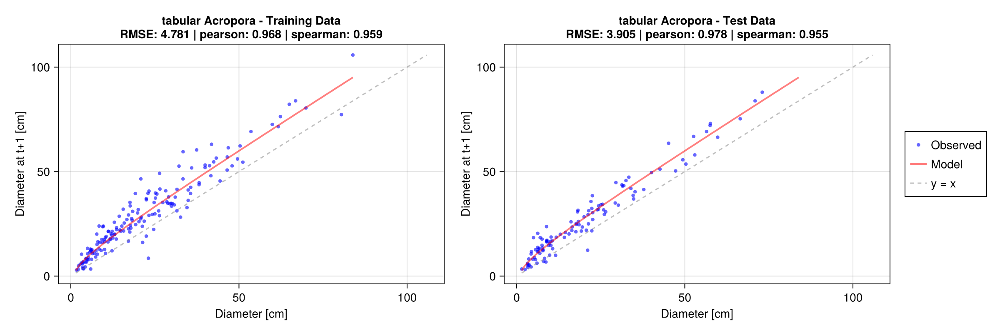{width="6.268054461942257in"
height="2.0893514873140857in"}

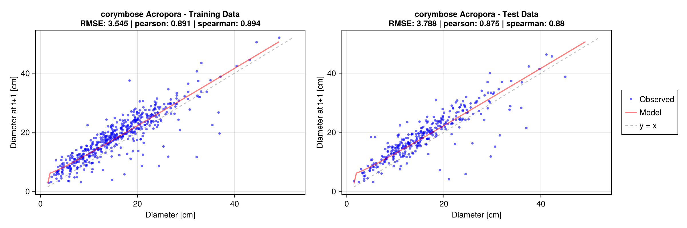{width="6.268054461942257in"
height="2.0893514873140857in"}

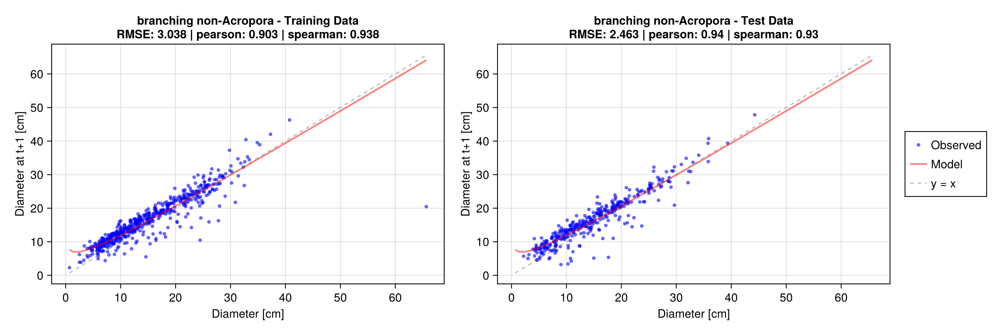{width="6.268054461942257in"
height="2.0893514873140857in"}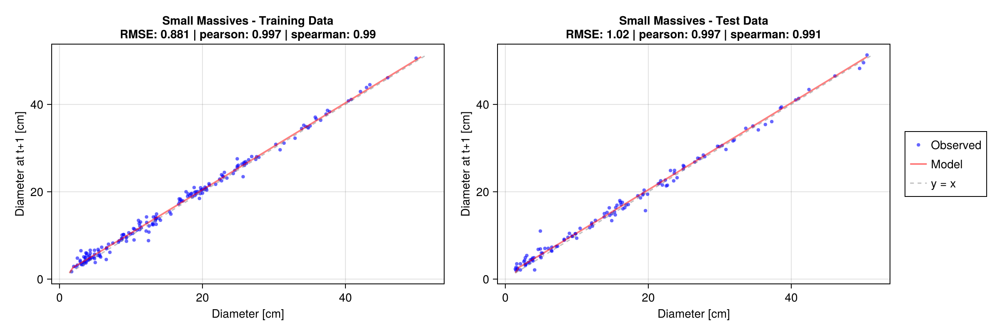{width="6.268054461942257in"
height="2.0893514873140857in"}

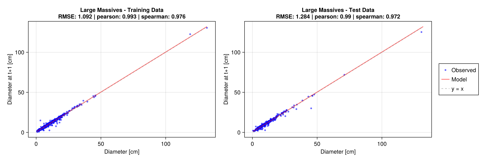{width="6.268054461942257in"
height="2.0893514873140857in"}

Regression coefficients and plots for the Torres Strait and Masig Reef
available from the study repository.

Growth regression performance metrics for Moore Reef (GBR North)

RMSE: 0.0 - Inf; Lower is better, where 0.0 indicates perfect fit.

R²: -∞ - 1.0; Higher is better, where 1.0 indicates perfect fit and
values below 0.0 indicate mean of observations is a more reliable
predictor.

Pearson: -1.0 - 1.0: Zero is no correlation, with higher/lower values
indicating positive/negative correlation

Spearman: -1.0 - 1.0: Zero is no correlation, with higher/lower values
indicating positive/negative correlation

Kendall: -1.0 - 1.0: Zero is no correlation, with higher/lower values
indicating positive/negative correlation

  : []{#_Ref226882754 .anchor}STable 4. Performance of fitted linear
  regressions for growth

  -------------------------------------------------------------------------------------------------------------------------------------
  **Group**          **Train\    **Test\   **Train\   **Test\    **Train\     **Test\     **Train\      **Test\    **Train\     **Test\
                         RMSE       RMSE     R^2^**    R^2^**   Pearson**   Pearson**   Spearman**   Spearman**   Kendall**   Kendall**
                     \[cm\]**   \[cm\]**
  ---------------- ---------- ---------- ---------- --------- ----------- ----------- ------------ ------------ ----------- -----------
  tabular               5.078      4.803      0.934     0.936       0.967       0.968        0.974        0.960       0.872       0.844
  *Acropora*

  corymbose             3.010      2.660      0.861     0.882       0.928       0.940        0.954        0.950       0.820       0.828
  *Acropora*

  corymbose\            1.258      1.399      0.967     0.961       0.983       0.980        0.979        0.978       0.878       0.875
  non-*Acropora*

  Small Massives        0.698      0.595      0.996     0.998       0.998       0.999        0.991        0.995       0.943       0.956

  Large Massives        0.743      0.562      0.990     0.994       0.995       0.997        0.985        0.993       0.927       0.937
  -------------------------------------------------------------------------------------------------------------------------------------

## Moore Reef -- Survival Regressions

Fitted diameter-size based survival regressions for Moore Reef (GBR
North)

  : []{#_Ref212386833 .anchor}STable 5. Coefficients of polynomial
  regression(s) fit to training data.

  ----------------------------------------------------------------
  **Group**            **Model**
  -------------------- -------------------------------------------
  tabular *Acropora*   0.366364 + 0.297959\*$\ln(d_{t})$ -
                       0.0468239\*$\ln\left( d_{t} \right)^{2}$

  corymbose *Acropora* 0.273274 + 0.455063\*$\ln(d_{t})$ -
                       0.092231\*$\ln\left( d_{t} \right)^{2}$

  corymbose            0.547199 + 0.193289\*$\ln(d_{t})$ -
  non-*Acropora*       0.0215031\*$\ln\left( d_{t} \right)^{2}$

  Small Massives       0.708588 + 0.128051\*$\ln(d_{t})$ -
                       0.0131708\*$\ln\left( d_{t} \right)^{2}$

  Large Massives       0.576681 + 0.204889\*$\ln(d_{t})$ -
                       0.0247534\*$\ln\left( d_{t} \right)^{2}$
  ----------------------------------------------------------------

Survival regression performance across train and test splits:

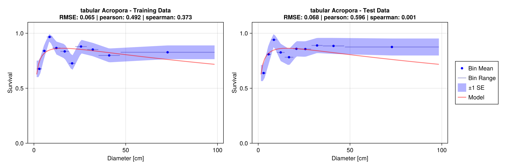{width="6.268054461942257in"
height="2.0893514873140857in"}

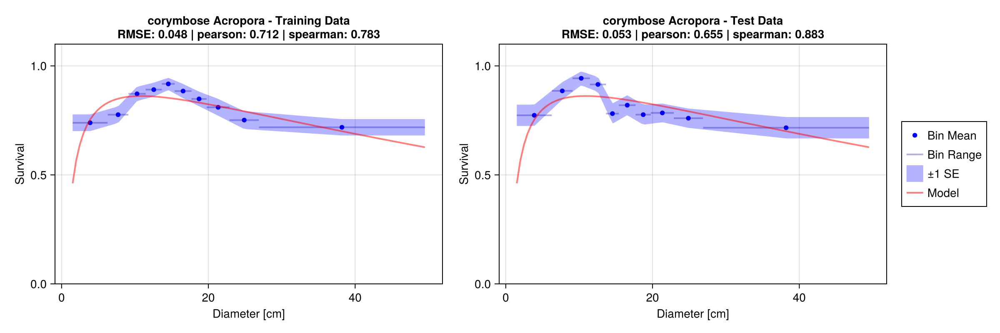{width="6.268054461942257in"
height="2.0893514873140857in"}

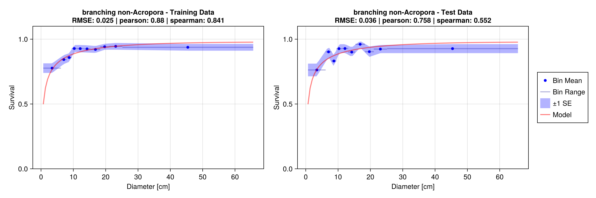{width="6.268054461942257in"
height="2.0893514873140857in"}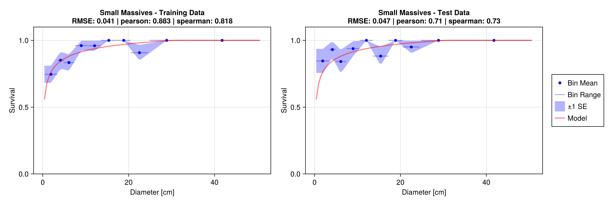{width="6.268054461942257in"
height="2.0893514873140857in"}

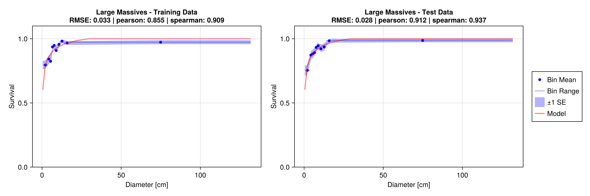{width="6.268054461942257in"
height="2.0893514873140857in"}

Regression coefficients and plots for the Torres Strait and Masig Reef
available from the study repository.

Survival regression performance metrics

Fitted 2-degree polynomials.

RMSE: 0.0 - Inf; Lower is better, where 0.0 indicates perfect fit.

R²: -∞ - 1.0; Higher is better, where 1.0 indicates perfect fit and
values below 0.0 indicate mean of observations is a more reliable
predictor.

Pearson: -1.0 - 1.0: Zero is no correlation, with higher/lower values
indicating positive/negative correlation

Spearman: -1.0 - 1.0: Zero is no correlation, with higher/lower values
indicating positive/negative correlation

Kendall: -1.0 - 1.0: Zero is no correlation, with higher/lower values
indicating positive/negative correlation

  : STable 6. Performance of two-degree polynomials fit to mean survival
  probabilities within defined bins.

  --------------------------------------------------------------------------------------------------------------------------------
  **Group**          **Train   **Test   **Train   **Test     **Train      **Test      **Train       **Test     **Train      **Test
                      RMSE**   RMSE**    R^2^**   R^2^**   Pearson**   Pearson**   Spearman**   Spearman**   Kendall**   Kendall**
  ---------------- --------- -------- --------- -------- ----------- ----------- ------------ ------------ ----------- -----------
  tabular              0.090    0.111     0.220    0.113       0.469       0.651       -0.045        0.318       -0.038       0.241
  *Acropora*

  corymbose            0.055    0.061     0.337    0.158       0.581       0.617        0.610        0.608       0.436       0.448
  *Acropora*

  corymbose            0.046    0.039     0.485    0.533       0.696       0.767        0.515        0.810       0.386       0.614
  non-*Acropora*

  Small Massives       0.047    0.059     0.565    0.632       0.752       0.877        0.668        0.934       0.498       0.804

  Large Massives       0.036    0.051     0.759    0.396       0.871       0.862        0.929        0.909       0.795       0.772
  --------------------------------------------------------------------------------------------------------------------------------

## Ensemble trajectories details

{width="4.818764216972879in"
height="7.317794181977253in"}

{width="5.906232502187226in"
height="9.026232502187227in"}

![[]{#_Ref218251464 .anchor}SFigure 5. Sensitivity analysis conducted
with PAWN method across unconstrained parameter ranges (n=8192) for
Moore Reef (16-071S; top row) and Masig Reef (bottom row). Factors are
sorted by mean PAWN indices. Density is shown to influence model
performance with respect to coral cover
predictions.](../figs/sensitivity/combined/combined_unconstrained_sa.png){width="6.121738845144357in"
height="3.8097594050743657in"}

## Parameter Interactions

Assessment of parameter interactions identifies compensatory
relationships with $|r|$ \> 0.5 at both reefs, with considerably more
interactions identified at Moore Reef (10 pairs) than at Masig Island (6
pairs). These are depicted in [STable 7](#_Ref227513502), [STable
8](#_Ref227513996), [SFigure 6](#_Ref218077805) and [SFigure
7](#_Ref218077853). At Masig Reef, four of the five interactions follow a
consistent pattern of proportion--size trade-offs within the same
functional group, where a higher proportion of a given group is
compensated by smaller mean colony sizes. A notable exception is a
strong positive correlation between the proportion and size variability
(σ) of large massives ($r$ = +0.923), indicating that ensembles
allocating more cover to large massives also require a wider spread of
colony sizes for that group. At Moore Reef, proportion--size trade-offs
within functional groups are similarly present, but the interaction
structure is more complex. Additional interactions include between-group
proportion trade-offs, density interactions with functional group
composition, and size mean--standard deviation trade-offs within
functional groups. The strongest correlation at Moore Reef is between
the mean and standard deviation of tabular *Acropora* colony sizes ($r$
= −0.824), indicating that the calibration cannot simultaneously
constrain the mean and spread of tabular *Acropora* sizes. A trade-off
between the two recruitment pathways is also identified ($r$ = −0.685
for external recruitment and self-seeding). Recruitment pathway
interactions are absent at Masig Reef for the remaining groups,
consistent with near-zero sensitivity of both recruitment parameters at
that site. The predominantly negative correlation structure reflects
proportion--size trade-offs within functional groups as the dominant
form of equifinality; at Moore Reef the interaction structure is more
varied, reflecting a more complex calibration landscape.

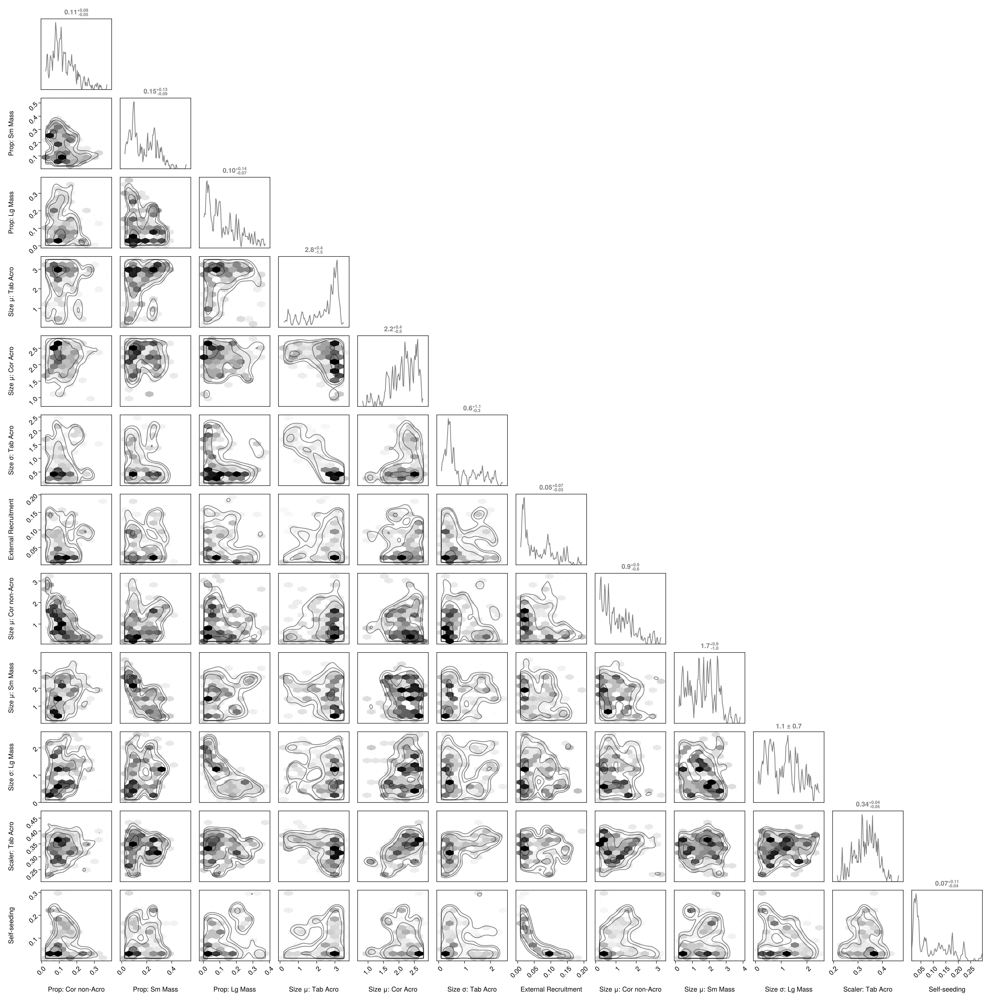{width="5.8360017497812775in"
height="5.883510498687664in"}

[]{#_Ref218077805 .anchor}SFigure 6. Pairplot illustrating parameter
interactions (where $|r| > 0.5$) for the ensemble calibrated for Moore
Reef.

  : []{#_Ref227513502 .anchor}STable 7. Parameter interactions for Moore
  Reef ensemble. Parameters with absolute Pearson correlation ($r$) $>$
  \|0.5\| shown.

  --------------------------------------------------------------------------
  Parameter 1                   Parameter 2                 Correlation
                                                            ($\mathbf{r}$)
  ----------------------------- --------------------------- ----------------
  Density                       Size μ: Tab Acro            −0.595

  Density                       Size σ: Tab Acro            +0.526

  Prop: Tab Acro                Scaler: Tab Acro            −0.553

  Prop: Cor non-Acro            Size μ: Cor non-Acro        −0.591

  Prop: Sm Mass                 Size μ: Sm Mass             −0.620

  Prop: Lg Mass                 Size μ: Lg Mass             −0.560

  Size μ: Tab Acro              Size σ: Tab Acro            −0.885

  Size μ: Cor Acro              Size σ: Cor Acro            −0.626

  Scaler: Tab Acro              Scaler: Cor Acro            +0.594

  External Recruitment          Self-seeding                −0.732
  --------------------------------------------------------------------------

![[]{#_Ref218077853 .anchor}SFigure 7. Pairplot illustrating parameter
interactions for Masig Reef in the Torres Strait where
($|r| > 0.5$).](../figs/sensitivity/torres_strait/masig/ensemble/masig_ensemble_corr_param_pairplot.png){width="6.190497594050743in"
height="6.272573272090988in"}

  : []{#_Ref227513996 .anchor}STable 8. Parameter interactions for the
  Masig Reef ensemble where Pearson correlation $(r) \geq |0.5|$.

  ------------------------------------------------------------------------
  Parameter 1                   Parameter 2               Correlation (r)
  ----------------------------- ------------------------- ----------------
  Prop: Tab Acro                Size μ: Tab Acro          −0.507

  Prop: Cor Acro                Size μ: Cor Acro          −0.622

  Prop: Cor non-Acro            Size μ: Cor non-Acro      −0.727

  Prop: Sm Mass                 Size μ: Sm Mass           −0.771

  Prop: Lg Mass                 Size μ: Lg Mass           −0.710

  Prop: Lg Mass                 Size σ: Lg Mass           +0.908
  ------------------------------------------------------------------------

## Temporal Sensitivity Analysis

![[]{#_Ref226930106 .anchor}SFigure 8. Temporal sensitivity analysis
conducted for Moore Reef (influence of factor on cover at t+2). Vertical
red dash line indicates the 2017 bleaching event (the corresponding
assessment timepoint is 2015). The influence of external recruitment and
self-seeding have markedly higher influence. Not shown are analyses
conducted for t+1, 3 and 5, which indicate varying relationships
(figures are available in the study
repository).](../figs/sensitivity/offshore_north/moore/ensemble/16071S_lagged_pawn_2yr_heatmap.png){width="6.260658355205599in"
height="3.6638877952755906in"}

## EcoRRAP-derived functional group cover

  : []{#_Ref227512243 .anchor}STable 9. Cover by functional group as
  derived from EcoRRAP photogrammetry for specific reef plots on Moore
  Reef (values in %). Observations are used for calibration/validation
  using Pearson log-correlation to assess modeled abundance by order of
  magnitude.

  --------------------------------------------------------------------------
  Year   Tabular      Corymbose       Branching        Small      Large
         Acropora     Acropora        non-Acropora     Massive    Massive
  ------ ------------ --------------- ---------------- ---------- ----------
  2021   1.39         3.51            1.89             2.09       1.07

  2022   2.03         3.66            1.91             2.07       1.50

  2023   1.85         3.27            2.08             2.39       1.51
  --------------------------------------------------------------------------

  : STable 10. Cover by functional group as derived from EcoRRAP
  photogrammetry for monitoring plots on Masig Reef (values in %).
  Observations are used for calibration/validation using Pearson
  log-correlation to assess modeled abundance by order of magnitude.

  --------------------------------------------------------------------------
  Year   Tabular      Corymbose       Branching        Small      Large
         Acropora     Acropora        non-Acropora     Massive    Massive
  ------ ------------ --------------- ---------------- ---------- ----------
  2021   0.32         1.33            0.84             2.25       10.12

  2022   0.33         1.27            1.03             1.89       9.82

  2023   0.45         1.27            1.16             1.55       10.40

  2024   0.35         1.41            1.04             2.04       10.56
  --------------------------------------------------------------------------

